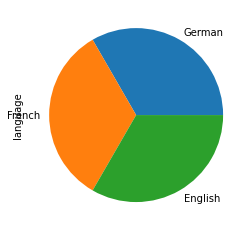
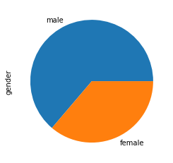
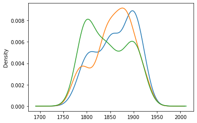

# lltk

Literary Language Tool Kit (LLTK): corpora, models, and tools for the study of complex language.

## Install


```python
# install
!pip install -qU git+https://github.com/quadrismegistus/lltk

# load lltk for use within python
import lltk

# show corpora in markdown
lltk.show()
```


| name                | desc                                                                                                                                                                      | license                                                                     | metadata                                                                           | freqs                                                                           | txt                                                                           | xml                                                                    | raw                                                                    |
|:--------------------|:--------------------------------------------------------------------------------------------------------------------------------------------------------------------------|:----------------------------------------------------------------------------|:-----------------------------------------------------------------------------------|:--------------------------------------------------------------------------------|:------------------------------------------------------------------------------|:-----------------------------------------------------------------------|:-----------------------------------------------------------------------|
| BPO                 | [British Periodicals Online](https://proquest.libguides.com/britishperiodicals)                                                                                           | Commercial                                                                  | ☂️                                                                                  |                                                                                 |                                                                               |                                                                        | ☂️                                                                      |
| CLMET               | [Corpus of Late Modern English Texts](https://perswww.kuleuven.be/~u0044428/clmet3_0.htm)                                                                                 | [Academic](https://ota.bodleian.ox.ac.uk/repository/xmlui/page/licence-ota) | [🌞](https://www.dropbox.com/s/m1jxj45al7b17cv/clmet_metadata.zip?dl=1)            | [🌞](https://www.dropbox.com/s/lnvwnbzskvqsu9p/clmet_freqs.zip?dl=1)            | ☂️                                                                             | ☂️                                                                      |                                                                        |
| COCA                | [Corpus of Contemporary American English](https://www.english-corpora.org/coca/)                                                                                          | Commercial                                                                  | ☂️                                                                                  | ☂️                                                                               | ☂️                                                                             |                                                                        | ☂️                                                                      |
| COHA                | [Corpus of Historical American English](https://www.english-corpora.org/coha/)                                                                                            | Commercial                                                                  | ☂️                                                                                  | ☂️                                                                               | ☂️                                                                             |                                                                        | ☂️                                                                      |
| Chadwyck            | [Chadwyck-Healey Fiction Collections](http://collections.chadwyck.co.uk/marketing/list_of_all.jsp)                                                                        | Mixed                                                                       | [🌞](https://www.dropbox.com/s/byqbi8sik255469/chadwyck_metadata.zip?dl=1)         | [🌞](https://www.dropbox.com/s/syluxyz1mcx5495/chadwyck_freqs.zip?dl=1)         | ☂️                                                                             | ☂️                                                                      | ☂️                                                                      |
| ChadwyckDrama       | [Chadwyck-Healey Drama Collections](http://collections.chadwyck.co.uk/marketing/list_of_all.jsp)                                                                          | Mixed                                                                       | ☂️                                                                                  | ☂️                                                                               | ☂️                                                                             | ☂️                                                                      | ☂️                                                                      |
| ChadwyckPoetry      | [Chadwyck-Healey Poetry Collections](http://collections.chadwyck.co.uk/marketing/list_of_all.jsp)                                                                         | Mixed                                                                       | ☂️                                                                                  | ☂️                                                                               | ☂️                                                                             | ☂️                                                                      | ☂️                                                                      |
| Chicago             | [U of Chicago Corpus of C20 Novels](https://textual-optics-lab.uchicago.edu/us_novel_corpus)                                                                              | Academic                                                                    | [🌞](https://www.dropbox.com/s/oba29ymlg7arhdu/chicago_metadata.zip?dl=1)          | [🌞](https://www.dropbox.com/s/w29o1urthijbxgn/chicago_freqs.zip?dl=1)          | ☂️                                                                             |                                                                        |                                                                        |
| DTA                 | [Deutsches Text Archiv](http://www.deutschestextarchiv.de)                                                                                                                | [Free](https://creativecommons.org/licenses/by-sa/4.0/)                     | [🌞](https://www.dropbox.com/s/294h2suvtu6sing/dta_metadata.zip?dl=1)              | [🌞](https://www.dropbox.com/s/nb1u0e77ng2d5mh/dta_freqs.zip?dl=1)              | [🌞](https://www.dropbox.com/s/8ez1tpa7awfb100/dta_txt.zip?dl=1)              | [🌞](https://www.dropbox.com/s/jy0o1cy37wioqqv/dta_xml.zip?dl=1)       | [🌞](http://media.dwds.de/dta/download/dta_komplett_2019-06-05.zip)    |
| DialNarr            | [Dialogue and Narration separated in Chadwyck-Healey Novels](https://doi.org/10.1093/llc/fqx031)                                                                          | Academic                                                                    | [🌞](https://www.dropbox.com/s/jw53k1mba6eumna/dialnarr_metadata.zip?dl=1)         | [🌞](https://www.dropbox.com/s/rgduzqatl4j0x5s/dialnarr_freqs.zip?dl=1)         | ☂️                                                                             |                                                                        |                                                                        |
| ECCO                | [Eighteenth Century Collections Online](https://www.gale.com/intl/primary-sources/eighteenth-century-collections-online)                                                  | Commercial                                                                  | ☂️                                                                                  | ☂️                                                                               | ☂️                                                                             | ☂️                                                                      | ☂️                                                                      |
| ECCO_TCP            | [ECCO (Text Creation Partnership)](https://textcreationpartnership.org/tcp-texts/ecco-tcp-eighteenth-century-collections-online/)                                         | Free                                                                        | [🌞](https://www.dropbox.com/s/xh991n4sohulczb/ecco_tcp_metadata.zip?dl=1)         | [🌞](https://www.dropbox.com/s/sdf5pdyifnrulyk/ecco_tcp_freqs.zip?dl=1)         | [🌞](https://www.dropbox.com/s/8sa4f6yqpz6ku3d/ecco_tcp_txt.zip?dl=1)         | [🌞](https://www.dropbox.com/s/vtv2iw7ujtivqss/ecco_tcp_xml.zip?dl=1)  | [🌞](https://www.dropbox.com/s/aubdaixvc59d8o9/ecco_tcp_raw.zip?dl=1)  |
| EEBO_TCP            | [Early English Books Online (curated by the Text Creation Partnership)](https://textcreationpartnership.org/tcp-texts/eebo-tcp-early-english-books-online/)               | Free                                                                        | [🌞](https://www.dropbox.com/s/th2i7jvuxksb0ma/eebo_tcp_metadata.zip?dl=1)         | [🌞](https://www.dropbox.com/s/n2oocs233wh5edo/eebo_tcp_freqs.zip?dl=1)         | [🌞](https://www.dropbox.com/s/otgqbs0vdli3gvb/eebo_tcp_txt.zip?dl=1)         | [🌞](https://www.dropbox.com/s/1wui9qjhkzy8fnm/eebo_tcp_xml.zip?dl=1)  |                                                                        |
| ESTC                | [English Short Title Catalogue](http://estc.ucr.edu/)                                                                                                                     | Academic                                                                    | ☂️                                                                                  |                                                                                 |                                                                               |                                                                        |                                                                        |
| EnglishDialogues    | [A Corpus of English Dialogues, 1560-1760](https://ota.bodleian.ox.ac.uk/repository/xmlui/handle/20.500.12024/2507)                                                       | [Academic](https://ota.bodleian.ox.ac.uk/repository/xmlui/page/licence-ota) | [🌞](https://www.dropbox.com/s/lcudgwmxdpspsc9/dialogues_metadata.zip?dl=1)        | [🌞](https://www.dropbox.com/s/tji67pv89e61wd6/dialogues_freqs.zip?dl=1)        |                                                                               | [🌞](https://www.dropbox.com/s/u07u3mrrom3i9f5/dialogues_xml.zip?dl=1) |                                                                        |
| EvansTCP            | [Early American Fiction](https://textcreationpartnership.org/tcp-texts/evans-tcp-evans-early-american-imprints/)                                                          | Free                                                                        | [🌞](https://www.dropbox.com/s/jr1j9i7wbz5uh0f/evans_tcp_metadata.zip?dl=1)        | [🌞](https://www.dropbox.com/s/4r426a5f6jk3tq8/evans_tcp_freqs.zip?dl=1)        | [🌞](https://www.dropbox.com/s/ezen3zxyt9hzxxp/evans_tcp_txt.zip?dl=1)        | [🌞](https://www.dropbox.com/s/yg7hjf536klg04c/evans_tcp_xml.zip?dl=1) | [🌞](https://www.dropbox.com/s/05qtu8r2xejqpkh/evans_tcp_raw.zip?dl=1) |
| GaleAmericanFiction | [Gale American Fiction, 1774-1920](https://www.gale.com/c/american-fiction-1774-1920)                                                                                     | Academic                                                                    | [🌞](https://www.dropbox.com/s/9ysabqrrx05832u/gale_amfic_metadata.zip?dl=1)       | [🌞](https://www.dropbox.com/s/7tbwfcgbcincdi1/gale_amfic_freqs.zip?dl=1)       | ☂️                                                                             |                                                                        | ☂️                                                                      |
| GildedAge           | [U.S. Fiction of the Gilded Age](https://doi.org/10.1093/llc/fqv066)                                                                                                      | Academic                                                                    | [🌞](https://www.dropbox.com/s/fg605k0cnebf70i/gildedage_metadata.zip?dl=1)        | [🌞](https://www.dropbox.com/s/i5zjhil743rm907/gildedage_freqs.zip?dl=1)        |                                                                               |                                                                        |                                                                        |
| HathiBio            | [Biographies from Hathi Trust](https://www.ideals.illinois.edu/handle/2142/99554)                                                                                         | Academic                                                                    | [🌞](https://www.dropbox.com/s/wth2i53gg0tq18a/hathi_bio_metadata.zip?dl=1)        |                                                                                 |                                                                               |                                                                        |                                                                        |
| HathiEngLit         | [Fiction, drama, verse word frequencies from Hathi Trust](https://wiki.htrc.illinois.edu/display/COM/Word+Frequencies+in+English-Language+Literature)                     | Academic                                                                    | [🌞](https://www.dropbox.com/s/gnwuwkpy4jybr5r/hathi_englit_metadata.zip?dl=1)     | [🌞](https://www.dropbox.com/s/jm858ej78x7h0vk/hathi_englit_freqs.zip?dl=1)     |                                                                               |                                                                        |                                                                        |
| InternetArchive     | [19th Century Novels, curated by the U of Illinois and hosted on the Internet Archive](https://archive.org/details/19thcennov?tab=about)                                  | Free                                                                        | [🌞](https://www.dropbox.com/s/yymc8t060eik7bt/internet_archive_metadata.zip?dl=1) | [🌞](https://www.dropbox.com/s/eofh9npy5x7qn5o/internet_archive_freqs.zip?dl=1) | [🌞](https://www.dropbox.com/s/bs1ec7k9kk2jkrt/internet_archive_txt.zip?dl=1) |                                                                        |                                                                        |
| LitLab              | [Literary Lab Corpus of 18th and 19th Century Novels](https://litlab.stanford.edu/LiteraryLabPamphlet11.pdf)                                                              | Academic                                                                    | [🌞](https://www.dropbox.com/s/ruur7jrckhm8nqz/litlab_metadata.zip?dl=1)           | [🌞](https://www.dropbox.com/s/itoj9a8n4vrjot9/litlab_freqs.zip?dl=1)           | ☂️                                                                             |                                                                        |                                                                        |
| MarkMark            | [Mark Algee-Hewitt's and Mark McGurl's 20th Century Corpus](https://litlab.stanford.edu/LiteraryLabPamphlet8.pdf)                                                         | Academic                                                                    | [🌞](https://www.dropbox.com/s/y5r316u8fzorx3g/markmark_metadata.zip?dl=1)         | [🌞](https://www.dropbox.com/s/xbjugeqndquph55/markmark_freqs.zip?dl=1)         | ☂️                                                                             |                                                                        |                                                                        |
| OldBailey           | [Old Bailey Online](https://www.oldbaileyonline.org/)                                                                                                                     | [Free](https://creativecommons.org/licenses/by-nc/4.0/)                     | [🌞](https://www.dropbox.com/s/zc6osrvsgp0n1m4/oldbailey_metadata.zip?dl=1)        | [🌞](https://www.dropbox.com/s/rwgt7q1f6pl65jh/oldbailey_freqs.zip?dl=1)        | [🌞](https://www.dropbox.com/s/yjsjnk4eyprifem/oldbailey_txt.zip?dl=1)        | [🌞](https://www.dropbox.com/s/90bsbu7re5tnbtp/oldbailey_xml.zip?dl=1) |                                                                        |
| RavenGarside        | [Raven & Garside's Bibliography of English Novels, 1770-1830](https://catalog.hathitrust.org/Record/004098100)                                                            | Academic                                                                    | ☂️                                                                                  |                                                                                 |                                                                               |                                                                        |                                                                        |
| SOTU                | [State of the Union Addresses](https://www.kaggle.com/rtatman/state-of-the-union-corpus-1989-2017)                                                                        | Free                                                                        | [🌞](https://www.dropbox.com/s/6gyueael6smbxyg/sotu_metadata.zip?dl=1)             | [🌞](https://www.dropbox.com/s/34gz1aifsot65fw/sotu_freqs.zip?dl=1)             | [🌞](https://www.dropbox.com/s/w73qio0thhfzdpx/sotu_txt.zip?dl=1)             |                                                                        |                                                                        |
| Sellers             | [19th Century Texts compiled by Jordan Sellers](http://journalofdigitalhumanities.org/1-2/the-emergence-of-literary-diction-by-ted-underwood-and-jordan-sellers/)         | Free                                                                        | [🌞](https://www.dropbox.com/s/7mos2k5qx8bdc1l/sellers_metadata.zip?dl=1)          | [🌞](https://www.dropbox.com/s/k293ip4wrswhl8j/sellers_freqs.zip?dl=1)          | [🌞](https://www.dropbox.com/s/j7e5my3s20n3xq4/sellers_txt.zip?dl=1)          |                                                                        |                                                                        |
| SemanticCohort      | [Corpus used in "Semantic Cohort Method" (2012)](https://litlab.stanford.edu/LiteraryLabPamphlet8.pdf)                                                                    | Free                                                                        | [🌞](https://www.dropbox.com/s/f6imhtfzgpf7tvz/semantic_cohort_metadata.zip?dl=1)  |                                                                                 |                                                                               |                                                                        |                                                                        |
| Spectator           | [The Spectator (1711-1714)](http://www.gutenberg.org/ebooks/12030)                                                                                                        | Free                                                                        | [🌞](https://www.dropbox.com/s/3cw2lcza68djzj1/spectator_metadata.zip?dl=1)        | [🌞](https://www.dropbox.com/s/sil5q31833rz4n0/spectator_freqs.zip?dl=1)        | [🌞](https://www.dropbox.com/s/goj6xbom3qnv5u5/spectator_txt.zip?dl=1)        |                                                                        |                                                                        |
| TedJDH              | [Corpus used in "Emergence of Literary Diction" (2012)](http://journalofdigitalhumanities.org/1-2/the-emergence-of-literary-diction-by-ted-underwood-and-jordan-sellers/) | Free                                                                        | [🌞](https://www.dropbox.com/s/ibjl7x0eyyz5zm6/tedjdh_metadata.zip?dl=1)           | [🌞](https://www.dropbox.com/s/igoxb4y7buctm5o/tedjdh_freqs.zip?dl=1)           | [🌞](https://www.dropbox.com/s/8ug3h24h5bggnx7/tedjdh_txt.zip?dl=1)           |                                                                        |                                                                        |
| TxtLab              | [A multilingual dataset of 450 novels](https://txtlab.org/2016/01/txtlab450-a-data-set-of-multilingual-novels-for-teaching-and-research)                                  | Free                                                                        | [🌞](https://www.dropbox.com/s/eh33qy6bcm7rvcp/txtlab_metadata.zip?dl=1)           | [🌞](https://www.dropbox.com/s/56azeswx0omjum2/txtlab_freqs.zip?dl=1)           | [🌞](https://www.dropbox.com/s/q4bm4yf76zgumi6/txtlab_txt.zip?dl=1)           |                                                                        | [🌞](https://github.com/christofs/txtlab450/archive/master.zip)        |


```python
# load a corpus: e.g. the txtLAB450 dataset of 450 En/Fr/Ger novels  
corpus = lltk.load('TxtLab')
```

    [TxtLab] Downloading txtlab_metadata.zip: 17.4kb [00:00, 20.2kb/s]                            
    [TxtLab] Unzipping txtlab_metadata.zip: 100%|██████████| 1/1 [00:00<00:00, 696.84it/s]
    [TxtLab] Downloading txtlab_freqs.zip: 21.4Mb [00:01, 16.2Mb/s]                            
    [TxtLab] Unzipping txtlab_freqs.zip: 100%|██████████| 410/410 [00:00<00:00, 638.10it/s]
    [TxtLab] Downloading txtlab_txt.zip: 95.1Mb [00:01, 55.9Mb/s]                            
    [TxtLab] Unzipping txtlab_txt.zip: 100%|██████████| 410/410 [00:02<00:00, 145.80it/s]

## Accessing metadata


```python
# metadata as dataframe
corpus.meta
```


<table  style="font-size:0.75em;" border="1" class="dataframe">
  <thead>
    <tr style="text-align: right;">
      <th></th>
      <th>author</th>
      <th>title</th>
      <th>year</th>
      <th>id_orig</th>
      <th>language</th>
      <th>date</th>
      <th>gender</th>
      <th>person</th>
      <th>length</th>
    </tr>
    <tr>
      <th>id</th>
      <th></th>
      <th></th>
      <th></th>
      <th></th>
      <th></th>
      <th></th>
      <th></th>
      <th></th>
      <th></th>
    </tr>
  </thead>
  <tbody>
    <tr>
      <th>DE_1771_La Roche,Sophievon_GeschichtedesFräuleinsvonSternheim_Novel</th>
      <td>La Roche,Sophievon</td>
      <td>GeschichtedesFräuleinsvonSternheim</td>
      <td>1771</td>
      <td>1</td>
      <td>German</td>
      <td>1771</td>
      <td>female</td>
      <td>first</td>
      <td>99070</td>
    </tr>
    <tr>
      <th>DE_1774_Goethe,Johann_DieLeidendesjungenWerthers1_Novel</th>
      <td>Goethe,Johann</td>
      <td>DieLeidendesjungenWerthers1</td>
      <td>1774</td>
      <td>2</td>
      <td>German</td>
      <td>1774</td>
      <td>male</td>
      <td>first</td>
      <td>34976</td>
    </tr>
    <tr>
      <th>DE_1774_Wieland,ChristophMartin_GeschichtederAbderiten_Novel</th>
      <td>Wieland,ChristophMartin</td>
      <td>GeschichtederAbderiten</td>
      <td>1774</td>
      <td>3</td>
      <td>German</td>
      <td>1774</td>
      <td>male</td>
      <td>first</td>
      <td>107398</td>
    </tr>
    <tr>
      <th>DE_1776_Nicolai,Friedrich_SebaldusNothanker_Novel</th>
      <td>Nicolai,Friedrich</td>
      <td>SebaldusNothanker</td>
      <td>1776</td>
      <td>4</td>
      <td>German</td>
      <td>1776</td>
      <td>male</td>
      <td>third</td>
      <td>122673</td>
    </tr>
    <tr>
      <th>DE_1779_Campe,Joachim_Robinson_Novel</th>
      <td>Campe,Joachim</td>
      <td>Robinson</td>
      <td>1779</td>
      <td>5</td>
      <td>German</td>
      <td>1779</td>
      <td>male</td>
      <td>third</td>
      <td>99439</td>
    </tr>
    <tr>
      <th>...</th>
      <td>...</td>
      <td>...</td>
      <td>...</td>
      <td>...</td>
      <td>...</td>
      <td>...</td>
      <td>...</td>
      <td>...</td>
      <td>...</td>
    </tr>
    <tr>
      <th>FR_1926_Giraudoux,Jean_Bella_Novel</th>
      <td>Giraudoux,Jean</td>
      <td>Bella</td>
      <td>1926</td>
      <td>446</td>
      <td>French</td>
      <td>1926</td>
      <td>male</td>
      <td>first</td>
      <td>47928</td>
    </tr>
    <tr>
      <th>FR_1926_Ramuz,CharlesFerdinand_GrandePeurDanslaMontagne_Novel</th>
      <td>Ramuz,CharlesFerdinand</td>
      <td>GrandePeurDanslaMontagne</td>
      <td>1926</td>
      <td>447</td>
      <td>French</td>
      <td>1926</td>
      <td>male</td>
      <td>first</td>
      <td>49205</td>
    </tr>
    <tr>
      <th>FR_1927_Bernanos,Georges_Limposture_Novel</th>
      <td>Bernanos,Georges</td>
      <td>Limposture</td>
      <td>1927</td>
      <td>448</td>
      <td>French</td>
      <td>1927</td>
      <td>male</td>
      <td>third</td>
      <td>79206</td>
    </tr>
    <tr>
      <th>FR_1927_Duhamel,Georges_JournaldeSalavin_Novel</th>
      <td>Duhamel,Georges</td>
      <td>JournaldeSalavin</td>
      <td>1927</td>
      <td>449</td>
      <td>French</td>
      <td>1927</td>
      <td>male</td>
      <td>first</td>
      <td>41694</td>
    </tr>
    <tr>
      <th>FR_1929_Dabit,Eugene_LhotelduNord_Novel</th>
      <td>Dabit,Eugene</td>
      <td>LhotelduNord</td>
      <td>1929</td>
      <td>450</td>
      <td>French</td>
      <td>1929</td>
      <td>male</td>
      <td>third</td>
      <td>35214</td>
    </tr>
  </tbody>
</table>
<p>450 rows × 9 columns</p>


```python
# filter metadata
smpl=corpus.meta.query('1770<=year<1780 & language=="English"')
smpl
```


<table  style="font-size:0.75em;" border="1" class="dataframe">
  <thead>
    <tr style="text-align: right;">
      <th></th>
      <th>author</th>
      <th>title</th>
      <th>year</th>
      <th>id_orig</th>
      <th>language</th>
      <th>date</th>
      <th>gender</th>
      <th>person</th>
      <th>length</th>
    </tr>
    <tr>
      <th>id</th>
      <th></th>
      <th></th>
      <th></th>
      <th></th>
      <th></th>
      <th></th>
      <th></th>
      <th></th>
      <th></th>
    </tr>
  </thead>
  <tbody>
    <tr>
      <th>EN_1771_Mackenzie,Henry_TheManofFeeling_Novel</th>
      <td>Mackenzie,Henry</td>
      <td>TheManofFeeling</td>
      <td>1771</td>
      <td>151</td>
      <td>English</td>
      <td>1771</td>
      <td>male</td>
      <td>first</td>
      <td>36458</td>
    </tr>
    <tr>
      <th>EN_1771_Smollett,Tobias_TheExpedictionofHenryClinker_Novel</th>
      <td>Smollett,Tobias</td>
      <td>TheExpedictionofHenryClinker</td>
      <td>1771</td>
      <td>152</td>
      <td>English</td>
      <td>1771</td>
      <td>male</td>
      <td>first</td>
      <td>148261</td>
    </tr>
    <tr>
      <th>EN_1778_Burney,Fanny_Evelina_Novel</th>
      <td>Burney,Fanny</td>
      <td>Evelina</td>
      <td>1778</td>
      <td>153</td>
      <td>English</td>
      <td>1778</td>
      <td>female</td>
      <td>first</td>
      <td>154168</td>
    </tr>
  </tbody>
</table>


## Plotting metadata


```python
# Breakdown of novels' language
corpus.meta['language'].value_counts().plot.pie()
```




```python
# Breakdown of author gender
corpus.meta['gender'].value_counts().plot.pie()
```





```python
# Distribution of years per language
corpus.meta.groupby('language').year.plot.density()
```




## Accessing data

### Most frequent words (MFW)


```python
# Most frequent words overall
corpus.mfw_df()
```

    [TxtLab] Counting overall most frequent words (MFW) [x2]: 100%|██████████| 410/410 [00:08<00:00, 46.07it/s]
    [TxtLab] Saving MFW to ~/lltk_data/corpora/txtlab/data/mfw/c28e0310dd87.ft


<table  style="font-size:0.75em;" border="1" class="dataframe">
  <thead>
    <tr style="text-align: right;">
      <th></th>
      <th>period</th>
      <th>word</th>
      <th>count</th>
      <th>fpm</th>
      <th>rank</th>
      <th>pos</th>
      <th>pos0</th>
    </tr>
  </thead>
  <tbody>
    <tr>
      <th>0</th>
      <td>all</td>
      <td>the</td>
      <td>958143</td>
      <td>22711.993767</td>
      <td>1</td>
      <td>at</td>
      <td>a</td>
    </tr>
    <tr>
      <th>1</th>
      <td>all</td>
      <td>and</td>
      <td>598747</td>
      <td>14192.806431</td>
      <td>2</td>
      <td>cc</td>
      <td>c</td>
    </tr>
    <tr>
      <th>2</th>
      <td>all</td>
      <td>of</td>
      <td>537139</td>
      <td>12732.439333</td>
      <td>4</td>
      <td>ii</td>
      <td>i</td>
    </tr>
    <tr>
      <th>3</th>
      <td>all</td>
      <td>to</td>
      <td>534618</td>
      <td>12672.681097</td>
      <td>5</td>
      <td>to</td>
      <td>t</td>
    </tr>
    <tr>
      <th>4</th>
      <td>all</td>
      <td>in</td>
      <td>455350</td>
      <td>10793.698187</td>
      <td>6</td>
      <td>ii</td>
      <td>i</td>
    </tr>
    <tr>
      <th>...</th>
      <td>...</td>
      <td>...</td>
      <td>...</td>
      <td>...</td>
      <td>...</td>
      <td>...</td>
      <td>...</td>
    </tr>
    <tr>
      <th>9229</th>
      <td>all</td>
      <td>convulsively</td>
      <td>105</td>
      <td>2.488939</td>
      <td>25044</td>
      <td>rr</td>
      <td>r</td>
    </tr>
    <tr>
      <th>9230</th>
      <td>all</td>
      <td>resuming</td>
      <td>105</td>
      <td>2.488939</td>
      <td>25065</td>
      <td>vvg</td>
      <td>v</td>
    </tr>
    <tr>
      <th>9231</th>
      <td>all</td>
      <td>vaults</td>
      <td>105</td>
      <td>2.488939</td>
      <td>25107</td>
      <td>nn2</td>
      <td>n</td>
    </tr>
    <tr>
      <th>9232</th>
      <td>all</td>
      <td>constructions</td>
      <td>105</td>
      <td>2.488939</td>
      <td>25146</td>
      <td>nn2</td>
      <td>n</td>
    </tr>
    <tr>
      <th>9233</th>
      <td>all</td>
      <td>mason</td>
      <td>105</td>
      <td>2.488939</td>
      <td>25147</td>
      <td>nn1</td>
      <td>n</td>
    </tr>
  </tbody>
</table>
<p>9234 rows × 7 columns</p>


```python
# Or, in more detail:

# set texts
english_texts = [t for t in corpus.texts() if t.language=='English']
# or: english_texts = corpus.meta.query('language=="English"')

# create dataframe
top_noun_by_period = corpus.mfw_df(
    texts=english_texts,               # specify texts (otherwise all)
    # how words work
    only_pos = {'n*'},                 # only part(s) of speech (Penn Treebank, n*)
    n=100,                             # Specify number of top words
    by_ntext=False,                    # Count number of documents not number of words
    by_fpm=True,                       # Count by within-text relative sums
    min_count=None,                    # Minimum count of word
    excl_stopwords=False,              # Exclude stopwords (set in config.txt)
    excl_top=200,                      # Exclude words ranked 1:`not_top`
    
    # how periods work
    yearbin=50,                        # Average relative counts across `yearbin` periods
    col_group='period',                # Which column to store `yearbin` period on
    n_by_period=None,                  # Number of top words per period
    keep_periods=True,                 # Keep periods in output dataframe
    n_agg='median',                    # How to aggregate across periods
    min_periods=None,                  # minimum number of periods a word must appear in
    valtype='fpm',                     # valtype to compute top words by
    #**attrs
)
top_noun_by_period
```


<table  style="font-size:0.75em;" border="1" class="dataframe">
  <thead>
    <tr style="text-align: right;">
      <th></th>
      <th>period</th>
      <th>word</th>
      <th>count</th>
      <th>fpm</th>
      <th>rank</th>
      <th>pos</th>
      <th>pos0</th>
    </tr>
  </thead>
  <tbody>
    <tr>
      <th>0</th>
      <td>1750</td>
      <td>power</td>
      <td>9092</td>
      <td>507.136841</td>
      <td>200</td>
      <td>nn1</td>
      <td>n</td>
    </tr>
    <tr>
      <th>1</th>
      <td>1800</td>
      <td>power</td>
      <td>12245</td>
      <td>341.786623</td>
      <td>286</td>
      <td>nn1</td>
      <td>n</td>
    </tr>
    <tr>
      <th>2</th>
      <td>1850</td>
      <td>power</td>
      <td>12489</td>
      <td>212.662942</td>
      <td>457</td>
      <td>nn1</td>
      <td>n</td>
    </tr>
    <tr>
      <th>3</th>
      <td>1900</td>
      <td>power</td>
      <td>6146</td>
      <td>166.838867</td>
      <td>598</td>
      <td>nn1</td>
      <td>n</td>
    </tr>
    <tr>
      <th>4</th>
      <td>1750</td>
      <td>woman</td>
      <td>8952</td>
      <td>499.327871</td>
      <td>202</td>
      <td>nn1</td>
      <td>n</td>
    </tr>
    <tr>
      <th>...</th>
      <td>...</td>
      <td>...</td>
      <td>...</td>
      <td>...</td>
      <td>...</td>
      <td>...</td>
      <td>...</td>
    </tr>
    <tr>
      <th>388</th>
      <td>1850</td>
      <td>letter</td>
      <td>18813</td>
      <td>320.348140</td>
      <td>313</td>
      <td>nn1</td>
      <td>n</td>
    </tr>
    <tr>
      <th>389</th>
      <td>1900</td>
      <td>letter</td>
      <td>8312</td>
      <td>225.636945</td>
      <td>430</td>
      <td>nn1</td>
      <td>n</td>
    </tr>
    <tr>
      <th>390</th>
      <td>1800</td>
      <td>person</td>
      <td>11640</td>
      <td>324.899657</td>
      <td>306</td>
      <td>nn1</td>
      <td>n</td>
    </tr>
    <tr>
      <th>391</th>
      <td>1850</td>
      <td>person</td>
      <td>12976</td>
      <td>220.955587</td>
      <td>445</td>
      <td>nn1</td>
      <td>n</td>
    </tr>
    <tr>
      <th>392</th>
      <td>1900</td>
      <td>person</td>
      <td>6605</td>
      <td>179.298847</td>
      <td>556</td>
      <td>nn1</td>
      <td>n</td>
    </tr>
  </tbody>
</table>
<p>393 rows × 7 columns</p>


```python
# Simple plot
import plotnine as p9
p9.options.figure_size=(11,9)
p9.ggplot(
    p9.aes(x='period',y='fpm',label='word',group='word'),
    data=top_noun_by_period
) + p9.facet_wrap('pos0') + p9.geom_line(alpha=0.25) + p9.geom_text(size=8) + p9.theme_classic()
```


## Document-term matrix


```python
# Get a document-term matrix
corpus.dtm()
```

    [TxtLab] Assembling document-term matrix (DTM) [x2]: 100%|██████████| 410/410 [00:05<00:00, 77.52it/s]
    [TxtLab] Saving DTM to ~/lltk_data/corpora/txtlab/data/dtm/9f91f08c231d.ft


<table  style="font-size:0.75em;" border="1" class="dataframe">
  <thead>
    <tr style="text-align: right;">
      <th></th>
      <th>the</th>
      <th>and</th>
      <th>of</th>
      <th>to</th>
      <th>in</th>
      <th>a</th>
      <th>was</th>
      <th>die</th>
      <th>he</th>
      <th>that</th>
      <th>her</th>
      <th>it</th>
      <th>his</th>
      <th>you</th>
      <th>she</th>
      <th>so</th>
      <th>had</th>
      <th>with</th>
      <th>as</th>
      <th>for</th>
      <th>me</th>
      <th>on</th>
      <th>not</th>
      <th>but</th>
      <th>den</th>
      <th>at</th>
      <th>an</th>
      <th>be</th>
      <th>my</th>
      <th>is</th>
      <th>him</th>
      <th>have</th>
      <th>which</th>
      <th>all</th>
      <th>pour</th>
      <th>by</th>
      <th>said</th>
      <th>this</th>
      <th>son</th>
      <th>war</th>
      <th>...</th>
      <th>consistency</th>
      <th>rebel</th>
      <th>gloomily</th>
      <th>jug</th>
      <th>shares</th>
      <th>notorious</th>
      <th>unearthly</th>
      <th>connect</th>
      <th>fabrication</th>
      <th>salutary</th>
      <th>suddenness</th>
      <th>ravine</th>
      <th>advocate</th>
      <th>uninterrupted</th>
      <th>damage</th>
      <th>aunts</th>
      <th>unavoidable</th>
      <th>uncovered</th>
      <th>sculpture</th>
      <th>gee</th>
      <th>exposing</th>
      <th>persuading</th>
      <th>extracted</th>
      <th>partook</th>
      <th>savanna</th>
      <th>differed</th>
      <th>successor</th>
      <th>drinks</th>
      <th>complaisant</th>
      <th>consigned</th>
      <th>competent</th>
      <th>constructions</th>
      <th>jus</th>
      <th>resuming</th>
      <th>ally</th>
      <th>variations</th>
      <th>perdition</th>
      <th>vaults</th>
      <th>mason</th>
      <th>convulsively</th>
    </tr>
    <tr>
      <th>id</th>
      <th></th>
      <th></th>
      <th></th>
      <th></th>
      <th></th>
      <th></th>
      <th></th>
      <th></th>
      <th></th>
      <th></th>
      <th></th>
      <th></th>
      <th></th>
      <th></th>
      <th></th>
      <th></th>
      <th></th>
      <th></th>
      <th></th>
      <th></th>
      <th></th>
      <th></th>
      <th></th>
      <th></th>
      <th></th>
      <th></th>
      <th></th>
      <th></th>
      <th></th>
      <th></th>
      <th></th>
      <th></th>
      <th></th>
      <th></th>
      <th></th>
      <th></th>
      <th></th>
      <th></th>
      <th></th>
      <th></th>
      <th></th>
      <th></th>
      <th></th>
      <th></th>
      <th></th>
      <th></th>
      <th></th>
      <th></th>
      <th></th>
      <th></th>
      <th></th>
      <th></th>
      <th></th>
      <th></th>
      <th></th>
      <th></th>
      <th></th>
      <th></th>
      <th></th>
      <th></th>
      <th></th>
      <th></th>
      <th></th>
      <th></th>
      <th></th>
      <th></th>
      <th></th>
      <th></th>
      <th></th>
      <th></th>
      <th></th>
      <th></th>
      <th></th>
      <th></th>
      <th></th>
      <th></th>
      <th></th>
      <th></th>
      <th></th>
      <th></th>
      <th></th>
    </tr>
  </thead>
  <tbody>
    <tr>
      <th>DE_1774_Goethe,Johann_DieLeidendesjungenWerthers1_Novel</th>
      <td>0.0</td>
      <td>0.0</td>
      <td>0.0</td>
      <td>0.0</td>
      <td>441.0</td>
      <td>1.0</td>
      <td>126.0</td>
      <td>836.0</td>
      <td>0.0</td>
      <td>11.0</td>
      <td>21.0</td>
      <td>0.0</td>
      <td>0.0</td>
      <td>0.0</td>
      <td>0.0</td>
      <td>352.0</td>
      <td>0.0</td>
      <td>0.0</td>
      <td>0.0</td>
      <td>0.0</td>
      <td>0.0</td>
      <td>0.0</td>
      <td>0.0</td>
      <td>0.0</td>
      <td>335.0</td>
      <td>0.0</td>
      <td>199.0</td>
      <td>0.0</td>
      <td>0.0</td>
      <td>0.0</td>
      <td>0.0</td>
      <td>0.0</td>
      <td>0.0</td>
      <td>91.0</td>
      <td>0.0</td>
      <td>0.0</td>
      <td>0.0</td>
      <td>0.0</td>
      <td>0.0</td>
      <td>163.0</td>
      <td>...</td>
      <td>0.0</td>
      <td>0.0</td>
      <td>0.0</td>
      <td>0.0</td>
      <td>0.0</td>
      <td>0.0</td>
      <td>0.0</td>
      <td>0.0</td>
      <td>0.0</td>
      <td>0.0</td>
      <td>0.0</td>
      <td>0.0</td>
      <td>0.0</td>
      <td>0.0</td>
      <td>0.0</td>
      <td>0.0</td>
      <td>0.0</td>
      <td>0.0</td>
      <td>0.0</td>
      <td>0.0</td>
      <td>0.0</td>
      <td>0.0</td>
      <td>0.0</td>
      <td>0.0</td>
      <td>0.0</td>
      <td>0.0</td>
      <td>0.0</td>
      <td>0.0</td>
      <td>0.0</td>
      <td>0.0</td>
      <td>0.0</td>
      <td>0.0</td>
      <td>0.0</td>
      <td>0.0</td>
      <td>0.0</td>
      <td>0.0</td>
      <td>0.0</td>
      <td>0.0</td>
      <td>0.0</td>
      <td>0.0</td>
    </tr>
    <tr>
      <th>DE_1774_Wieland,ChristophMartin_GeschichtederAbderiten_Novel</th>
      <td>0.0</td>
      <td>0.0</td>
      <td>0.0</td>
      <td>0.0</td>
      <td>1456.0</td>
      <td>2.0</td>
      <td>575.0</td>
      <td>3099.0</td>
      <td>1.0</td>
      <td>0.0</td>
      <td>37.0</td>
      <td>0.0</td>
      <td>0.0</td>
      <td>0.0</td>
      <td>0.0</td>
      <td>1335.0</td>
      <td>0.0</td>
      <td>0.0</td>
      <td>0.0</td>
      <td>1.0</td>
      <td>0.0</td>
      <td>0.0</td>
      <td>13.0</td>
      <td>0.0</td>
      <td>1296.0</td>
      <td>0.0</td>
      <td>444.0</td>
      <td>6.0</td>
      <td>0.0</td>
      <td>0.0</td>
      <td>0.0</td>
      <td>0.0</td>
      <td>0.0</td>
      <td>3.0</td>
      <td>0.0</td>
      <td>0.0</td>
      <td>0.0</td>
      <td>0.0</td>
      <td>0.0</td>
      <td>677.0</td>
      <td>...</td>
      <td>0.0</td>
      <td>0.0</td>
      <td>0.0</td>
      <td>0.0</td>
      <td>0.0</td>
      <td>0.0</td>
      <td>0.0</td>
      <td>0.0</td>
      <td>0.0</td>
      <td>0.0</td>
      <td>0.0</td>
      <td>0.0</td>
      <td>0.0</td>
      <td>0.0</td>
      <td>0.0</td>
      <td>0.0</td>
      <td>0.0</td>
      <td>0.0</td>
      <td>0.0</td>
      <td>0.0</td>
      <td>0.0</td>
      <td>0.0</td>
      <td>0.0</td>
      <td>0.0</td>
      <td>0.0</td>
      <td>0.0</td>
      <td>0.0</td>
      <td>0.0</td>
      <td>0.0</td>
      <td>0.0</td>
      <td>0.0</td>
      <td>0.0</td>
      <td>0.0</td>
      <td>0.0</td>
      <td>0.0</td>
      <td>0.0</td>
      <td>0.0</td>
      <td>0.0</td>
      <td>0.0</td>
      <td>0.0</td>
    </tr>
    <tr>
      <th>DE_1776_Nicolai,Friedrich_SebaldusNothanker_Novel</th>
      <td>3.0</td>
      <td>7.0</td>
      <td>3.0</td>
      <td>2.0</td>
      <td>1900.0</td>
      <td>7.0</td>
      <td>292.0</td>
      <td>2871.0</td>
      <td>4.0</td>
      <td>0.0</td>
      <td>15.0</td>
      <td>1.0</td>
      <td>0.0</td>
      <td>0.0</td>
      <td>0.0</td>
      <td>1042.0</td>
      <td>0.0</td>
      <td>1.0</td>
      <td>1.0</td>
      <td>1.0</td>
      <td>1.0</td>
      <td>3.0</td>
      <td>11.0</td>
      <td>1.0</td>
      <td>1371.0</td>
      <td>0.0</td>
      <td>567.0</td>
      <td>5.0</td>
      <td>0.0</td>
      <td>1.0</td>
      <td>0.0</td>
      <td>0.0</td>
      <td>0.0</td>
      <td>2.0</td>
      <td>2.0</td>
      <td>1.0</td>
      <td>0.0</td>
      <td>0.0</td>
      <td>0.0</td>
      <td>733.0</td>
      <td>...</td>
      <td>0.0</td>
      <td>0.0</td>
      <td>0.0</td>
      <td>0.0</td>
      <td>0.0</td>
      <td>0.0</td>
      <td>0.0</td>
      <td>0.0</td>
      <td>0.0</td>
      <td>0.0</td>
      <td>0.0</td>
      <td>0.0</td>
      <td>0.0</td>
      <td>0.0</td>
      <td>0.0</td>
      <td>0.0</td>
      <td>0.0</td>
      <td>0.0</td>
      <td>0.0</td>
      <td>0.0</td>
      <td>0.0</td>
      <td>0.0</td>
      <td>0.0</td>
      <td>0.0</td>
      <td>0.0</td>
      <td>0.0</td>
      <td>0.0</td>
      <td>0.0</td>
      <td>0.0</td>
      <td>0.0</td>
      <td>0.0</td>
      <td>0.0</td>
      <td>1.0</td>
      <td>0.0</td>
      <td>0.0</td>
      <td>0.0</td>
      <td>0.0</td>
      <td>0.0</td>
      <td>0.0</td>
      <td>0.0</td>
    </tr>
    <tr>
      <th>DE_1779_Campe,Joachim_Robinson_Novel</th>
      <td>0.0</td>
      <td>0.0</td>
      <td>0.0</td>
      <td>0.0</td>
      <td>1017.0</td>
      <td>8.0</td>
      <td>538.0</td>
      <td>2053.0</td>
      <td>0.0</td>
      <td>48.0</td>
      <td>34.0</td>
      <td>0.0</td>
      <td>0.0</td>
      <td>0.0</td>
      <td>0.0</td>
      <td>1293.0</td>
      <td>0.0</td>
      <td>0.0</td>
      <td>0.0</td>
      <td>0.0</td>
      <td>0.0</td>
      <td>1.0</td>
      <td>0.0</td>
      <td>0.0</td>
      <td>941.0</td>
      <td>0.0</td>
      <td>515.0</td>
      <td>10.0</td>
      <td>0.0</td>
      <td>0.0</td>
      <td>0.0</td>
      <td>0.0</td>
      <td>0.0</td>
      <td>4.0</td>
      <td>0.0</td>
      <td>0.0</td>
      <td>0.0</td>
      <td>0.0</td>
      <td>1.0</td>
      <td>739.0</td>
      <td>...</td>
      <td>0.0</td>
      <td>0.0</td>
      <td>0.0</td>
      <td>0.0</td>
      <td>0.0</td>
      <td>0.0</td>
      <td>0.0</td>
      <td>0.0</td>
      <td>0.0</td>
      <td>0.0</td>
      <td>0.0</td>
      <td>0.0</td>
      <td>0.0</td>
      <td>0.0</td>
      <td>0.0</td>
      <td>0.0</td>
      <td>0.0</td>
      <td>0.0</td>
      <td>0.0</td>
      <td>0.0</td>
      <td>0.0</td>
      <td>0.0</td>
      <td>0.0</td>
      <td>0.0</td>
      <td>0.0</td>
      <td>0.0</td>
      <td>0.0</td>
      <td>0.0</td>
      <td>0.0</td>
      <td>0.0</td>
      <td>0.0</td>
      <td>0.0</td>
      <td>0.0</td>
      <td>0.0</td>
      <td>0.0</td>
      <td>0.0</td>
      <td>0.0</td>
      <td>0.0</td>
      <td>0.0</td>
      <td>0.0</td>
    </tr>
    <tr>
      <th>DE_1779_Jacobi,Friedrich_Woldemar_Novel</th>
      <td>0.0</td>
      <td>0.0</td>
      <td>0.0</td>
      <td>0.0</td>
      <td>411.0</td>
      <td>3.0</td>
      <td>136.0</td>
      <td>591.0</td>
      <td>0.0</td>
      <td>16.0</td>
      <td>16.0</td>
      <td>0.0</td>
      <td>0.0</td>
      <td>0.0</td>
      <td>0.0</td>
      <td>365.0</td>
      <td>0.0</td>
      <td>0.0</td>
      <td>0.0</td>
      <td>0.0</td>
      <td>0.0</td>
      <td>0.0</td>
      <td>0.0</td>
      <td>0.0</td>
      <td>240.0</td>
      <td>0.0</td>
      <td>215.0</td>
      <td>3.0</td>
      <td>0.0</td>
      <td>0.0</td>
      <td>1.0</td>
      <td>0.0</td>
      <td>0.0</td>
      <td>19.0</td>
      <td>0.0</td>
      <td>0.0</td>
      <td>0.0</td>
      <td>0.0</td>
      <td>2.0</td>
      <td>253.0</td>
      <td>...</td>
      <td>0.0</td>
      <td>0.0</td>
      <td>0.0</td>
      <td>0.0</td>
      <td>0.0</td>
      <td>0.0</td>
      <td>0.0</td>
      <td>0.0</td>
      <td>0.0</td>
      <td>0.0</td>
      <td>0.0</td>
      <td>0.0</td>
      <td>0.0</td>
      <td>0.0</td>
      <td>0.0</td>
      <td>0.0</td>
      <td>0.0</td>
      <td>0.0</td>
      <td>0.0</td>
      <td>0.0</td>
      <td>0.0</td>
      <td>0.0</td>
      <td>0.0</td>
      <td>0.0</td>
      <td>0.0</td>
      <td>0.0</td>
      <td>0.0</td>
      <td>0.0</td>
      <td>0.0</td>
      <td>0.0</td>
      <td>0.0</td>
      <td>0.0</td>
      <td>0.0</td>
      <td>0.0</td>
      <td>0.0</td>
      <td>0.0</td>
      <td>0.0</td>
      <td>0.0</td>
      <td>0.0</td>
      <td>0.0</td>
    </tr>
    <tr>
      <th>...</th>
      <td>...</td>
      <td>...</td>
      <td>...</td>
      <td>...</td>
      <td>...</td>
      <td>...</td>
      <td>...</td>
      <td>...</td>
      <td>...</td>
      <td>...</td>
      <td>...</td>
      <td>...</td>
      <td>...</td>
      <td>...</td>
      <td>...</td>
      <td>...</td>
      <td>...</td>
      <td>...</td>
      <td>...</td>
      <td>...</td>
      <td>...</td>
      <td>...</td>
      <td>...</td>
      <td>...</td>
      <td>...</td>
      <td>...</td>
      <td>...</td>
      <td>...</td>
      <td>...</td>
      <td>...</td>
      <td>...</td>
      <td>...</td>
      <td>...</td>
      <td>...</td>
      <td>...</td>
      <td>...</td>
      <td>...</td>
      <td>...</td>
      <td>...</td>
      <td>...</td>
      <td>...</td>
      <td>...</td>
      <td>...</td>
      <td>...</td>
      <td>...</td>
      <td>...</td>
      <td>...</td>
      <td>...</td>
      <td>...</td>
      <td>...</td>
      <td>...</td>
      <td>...</td>
      <td>...</td>
      <td>...</td>
      <td>...</td>
      <td>...</td>
      <td>...</td>
      <td>...</td>
      <td>...</td>
      <td>...</td>
      <td>...</td>
      <td>...</td>
      <td>...</td>
      <td>...</td>
      <td>...</td>
      <td>...</td>
      <td>...</td>
      <td>...</td>
      <td>...</td>
      <td>...</td>
      <td>...</td>
      <td>...</td>
      <td>...</td>
      <td>...</td>
      <td>...</td>
      <td>...</td>
      <td>...</td>
      <td>...</td>
      <td>...</td>
      <td>...</td>
      <td>...</td>
    </tr>
    <tr>
      <th>FR_1926_Giraudoux,Jean_Bella_Novel</th>
      <td>0.0</td>
      <td>0.0</td>
      <td>0.0</td>
      <td>0.0</td>
      <td>0.0</td>
      <td>27.0</td>
      <td>0.0</td>
      <td>0.0</td>
      <td>0.0</td>
      <td>0.0</td>
      <td>0.0</td>
      <td>0.0</td>
      <td>0.0</td>
      <td>0.0</td>
      <td>0.0</td>
      <td>0.0</td>
      <td>0.0</td>
      <td>0.0</td>
      <td>0.0</td>
      <td>0.0</td>
      <td>77.0</td>
      <td>91.0</td>
      <td>0.0</td>
      <td>3.0</td>
      <td>0.0</td>
      <td>0.0</td>
      <td>0.0</td>
      <td>0.0</td>
      <td>0.0</td>
      <td>0.0</td>
      <td>0.0</td>
      <td>0.0</td>
      <td>0.0</td>
      <td>0.0</td>
      <td>422.0</td>
      <td>0.0</td>
      <td>0.0</td>
      <td>0.0</td>
      <td>311.0</td>
      <td>0.0</td>
      <td>...</td>
      <td>0.0</td>
      <td>0.0</td>
      <td>0.0</td>
      <td>0.0</td>
      <td>0.0</td>
      <td>0.0</td>
      <td>0.0</td>
      <td>0.0</td>
      <td>0.0</td>
      <td>0.0</td>
      <td>0.0</td>
      <td>0.0</td>
      <td>0.0</td>
      <td>0.0</td>
      <td>0.0</td>
      <td>0.0</td>
      <td>0.0</td>
      <td>0.0</td>
      <td>0.0</td>
      <td>0.0</td>
      <td>0.0</td>
      <td>0.0</td>
      <td>0.0</td>
      <td>0.0</td>
      <td>0.0</td>
      <td>0.0</td>
      <td>0.0</td>
      <td>0.0</td>
      <td>0.0</td>
      <td>0.0</td>
      <td>0.0</td>
      <td>1.0</td>
      <td>0.0</td>
      <td>0.0</td>
      <td>0.0</td>
      <td>0.0</td>
      <td>0.0</td>
      <td>0.0</td>
      <td>0.0</td>
      <td>0.0</td>
    </tr>
    <tr>
      <th>FR_1926_Ramuz,CharlesFerdinand_GrandePeurDanslaMontagne_Novel</th>
      <td>0.0</td>
      <td>0.0</td>
      <td>0.0</td>
      <td>0.0</td>
      <td>0.0</td>
      <td>599.0</td>
      <td>0.0</td>
      <td>0.0</td>
      <td>0.0</td>
      <td>0.0</td>
      <td>0.0</td>
      <td>0.0</td>
      <td>0.0</td>
      <td>0.0</td>
      <td>0.0</td>
      <td>0.0</td>
      <td>0.0</td>
      <td>0.0</td>
      <td>8.0</td>
      <td>0.0</td>
      <td>23.0</td>
      <td>613.0</td>
      <td>0.0</td>
      <td>0.0</td>
      <td>0.0</td>
      <td>0.0</td>
      <td>2.0</td>
      <td>0.0</td>
      <td>0.0</td>
      <td>0.0</td>
      <td>0.0</td>
      <td>0.0</td>
      <td>0.0</td>
      <td>0.0</td>
      <td>230.0</td>
      <td>0.0</td>
      <td>0.0</td>
      <td>0.0</td>
      <td>273.0</td>
      <td>0.0</td>
      <td>...</td>
      <td>0.0</td>
      <td>0.0</td>
      <td>0.0</td>
      <td>0.0</td>
      <td>0.0</td>
      <td>0.0</td>
      <td>0.0</td>
      <td>0.0</td>
      <td>0.0</td>
      <td>0.0</td>
      <td>0.0</td>
      <td>0.0</td>
      <td>0.0</td>
      <td>0.0</td>
      <td>0.0</td>
      <td>0.0</td>
      <td>0.0</td>
      <td>0.0</td>
      <td>0.0</td>
      <td>0.0</td>
      <td>0.0</td>
      <td>0.0</td>
      <td>0.0</td>
      <td>0.0</td>
      <td>0.0</td>
      <td>0.0</td>
      <td>0.0</td>
      <td>0.0</td>
      <td>0.0</td>
      <td>0.0</td>
      <td>0.0</td>
      <td>0.0</td>
      <td>0.0</td>
      <td>0.0</td>
      <td>0.0</td>
      <td>0.0</td>
      <td>0.0</td>
      <td>0.0</td>
      <td>0.0</td>
      <td>0.0</td>
    </tr>
    <tr>
      <th>FR_1927_Bernanos,Georges_Limposture_Novel</th>
      <td>0.0</td>
      <td>0.0</td>
      <td>0.0</td>
      <td>0.0</td>
      <td>0.0</td>
      <td>218.0</td>
      <td>0.0</td>
      <td>0.0</td>
      <td>0.0</td>
      <td>0.0</td>
      <td>0.0</td>
      <td>0.0</td>
      <td>0.0</td>
      <td>0.0</td>
      <td>0.0</td>
      <td>0.0</td>
      <td>0.0</td>
      <td>0.0</td>
      <td>4.0</td>
      <td>1.0</td>
      <td>237.0</td>
      <td>137.0</td>
      <td>0.0</td>
      <td>11.0</td>
      <td>0.0</td>
      <td>0.0</td>
      <td>1.0</td>
      <td>0.0</td>
      <td>0.0</td>
      <td>0.0</td>
      <td>0.0</td>
      <td>0.0</td>
      <td>0.0</td>
      <td>0.0</td>
      <td>419.0</td>
      <td>0.0</td>
      <td>0.0</td>
      <td>0.0</td>
      <td>696.0</td>
      <td>0.0</td>
      <td>...</td>
      <td>0.0</td>
      <td>0.0</td>
      <td>0.0</td>
      <td>0.0</td>
      <td>0.0</td>
      <td>0.0</td>
      <td>0.0</td>
      <td>0.0</td>
      <td>0.0</td>
      <td>0.0</td>
      <td>0.0</td>
      <td>0.0</td>
      <td>0.0</td>
      <td>0.0</td>
      <td>0.0</td>
      <td>0.0</td>
      <td>0.0</td>
      <td>0.0</td>
      <td>0.0</td>
      <td>0.0</td>
      <td>0.0</td>
      <td>0.0</td>
      <td>0.0</td>
      <td>0.0</td>
      <td>0.0</td>
      <td>0.0</td>
      <td>0.0</td>
      <td>0.0</td>
      <td>0.0</td>
      <td>0.0</td>
      <td>0.0</td>
      <td>0.0</td>
      <td>0.0</td>
      <td>0.0</td>
      <td>0.0</td>
      <td>0.0</td>
      <td>0.0</td>
      <td>0.0</td>
      <td>0.0</td>
      <td>0.0</td>
    </tr>
    <tr>
      <th>FR_1927_Duhamel,Georges_JournaldeSalavin_Novel</th>
      <td>0.0</td>
      <td>0.0</td>
      <td>0.0</td>
      <td>0.0</td>
      <td>1.0</td>
      <td>170.0</td>
      <td>0.0</td>
      <td>0.0</td>
      <td>0.0</td>
      <td>0.0</td>
      <td>0.0</td>
      <td>0.0</td>
      <td>0.0</td>
      <td>0.0</td>
      <td>0.0</td>
      <td>0.0</td>
      <td>0.0</td>
      <td>0.0</td>
      <td>5.0</td>
      <td>0.0</td>
      <td>499.0</td>
      <td>62.0</td>
      <td>0.0</td>
      <td>5.0</td>
      <td>0.0</td>
      <td>0.0</td>
      <td>6.0</td>
      <td>0.0</td>
      <td>0.0</td>
      <td>0.0</td>
      <td>0.0</td>
      <td>0.0</td>
      <td>0.0</td>
      <td>0.0</td>
      <td>271.0</td>
      <td>0.0</td>
      <td>0.0</td>
      <td>0.0</td>
      <td>108.0</td>
      <td>0.0</td>
      <td>...</td>
      <td>0.0</td>
      <td>0.0</td>
      <td>0.0</td>
      <td>0.0</td>
      <td>0.0</td>
      <td>0.0</td>
      <td>0.0</td>
      <td>0.0</td>
      <td>1.0</td>
      <td>0.0</td>
      <td>0.0</td>
      <td>0.0</td>
      <td>0.0</td>
      <td>0.0</td>
      <td>0.0</td>
      <td>0.0</td>
      <td>0.0</td>
      <td>0.0</td>
      <td>0.0</td>
      <td>0.0</td>
      <td>0.0</td>
      <td>0.0</td>
      <td>0.0</td>
      <td>0.0</td>
      <td>0.0</td>
      <td>0.0</td>
      <td>0.0</td>
      <td>0.0</td>
      <td>1.0</td>
      <td>0.0</td>
      <td>0.0</td>
      <td>0.0</td>
      <td>0.0</td>
      <td>0.0</td>
      <td>0.0</td>
      <td>0.0</td>
      <td>0.0</td>
      <td>0.0</td>
      <td>0.0</td>
      <td>0.0</td>
    </tr>
    <tr>
      <th>FR_1929_Dabit,Eugene_LhotelduNord_Novel</th>
      <td>0.0</td>
      <td>0.0</td>
      <td>0.0</td>
      <td>0.0</td>
      <td>0.0</td>
      <td>94.0</td>
      <td>0.0</td>
      <td>0.0</td>
      <td>0.0</td>
      <td>0.0</td>
      <td>0.0</td>
      <td>0.0</td>
      <td>0.0</td>
      <td>0.0</td>
      <td>0.0</td>
      <td>0.0</td>
      <td>0.0</td>
      <td>0.0</td>
      <td>6.0</td>
      <td>0.0</td>
      <td>45.0</td>
      <td>188.0</td>
      <td>0.0</td>
      <td>4.0</td>
      <td>0.0</td>
      <td>0.0</td>
      <td>1.0</td>
      <td>0.0</td>
      <td>0.0</td>
      <td>0.0</td>
      <td>0.0</td>
      <td>0.0</td>
      <td>0.0</td>
      <td>0.0</td>
      <td>183.0</td>
      <td>0.0</td>
      <td>0.0</td>
      <td>0.0</td>
      <td>372.0</td>
      <td>0.0</td>
      <td>...</td>
      <td>0.0</td>
      <td>0.0</td>
      <td>0.0</td>
      <td>0.0</td>
      <td>0.0</td>
      <td>0.0</td>
      <td>0.0</td>
      <td>0.0</td>
      <td>0.0</td>
      <td>0.0</td>
      <td>0.0</td>
      <td>0.0</td>
      <td>0.0</td>
      <td>0.0</td>
      <td>0.0</td>
      <td>0.0</td>
      <td>0.0</td>
      <td>0.0</td>
      <td>0.0</td>
      <td>0.0</td>
      <td>0.0</td>
      <td>0.0</td>
      <td>0.0</td>
      <td>0.0</td>
      <td>0.0</td>
      <td>0.0</td>
      <td>0.0</td>
      <td>0.0</td>
      <td>0.0</td>
      <td>0.0</td>
      <td>0.0</td>
      <td>0.0</td>
      <td>7.0</td>
      <td>0.0</td>
      <td>0.0</td>
      <td>0.0</td>
      <td>0.0</td>
      <td>0.0</td>
      <td>0.0</td>
      <td>0.0</td>
    </tr>
  </tbody>
</table>
<p>410 rows × 9234 columns</p>


```python
# Filter
tfs = corpus.dtm(
    texts=[t for t in corpus.texts() if t.language=='English'],
    n=1000,
    only_pos={'n*'},
    tf=True,
    meta=['year']
)
fpms = tfs * 1000000
fpms
```


<table  style="font-size:0.75em;" border="1" class="dataframe">
  <thead>
    <tr style="text-align: right;">
      <th></th>
      <th></th>
      <th>son</th>
      <th>war</th>
      <th>man</th>
      <th>time</th>
      <th>hand</th>
      <th>moment</th>
      <th>hat</th>
      <th>way</th>
      <th>madame</th>
      <th>point</th>
      <th>day</th>
      <th>face</th>
      <th>place</th>
      <th>life</th>
      <th>eyes</th>
      <th>lady</th>
      <th>house</th>
      <th>sir</th>
      <th>mind</th>
      <th>monsieur</th>
      <th>father</th>
      <th>love</th>
      <th>heart</th>
      <th>men</th>
      <th>kind</th>
      <th>mother</th>
      <th>room</th>
      <th>head</th>
      <th>thing</th>
      <th>part</th>
      <th>night</th>
      <th>people</th>
      <th>things</th>
      <th>car</th>
      <th>door</th>
      <th>world</th>
      <th>home</th>
      <th>voice</th>
      <th>woman</th>
      <th>lord</th>
      <th>...</th>
      <th>lordship</th>
      <th>souls</th>
      <th>cloak</th>
      <th>leisure</th>
      <th>qualities</th>
      <th>wit</th>
      <th>poetry</th>
      <th>merit</th>
      <th>characters</th>
      <th>proposal</th>
      <th>waves</th>
      <th>shoes</th>
      <th>inquiries</th>
      <th>decision</th>
      <th>misfortune</th>
      <th>brothers</th>
      <th>gates</th>
      <th>bedroom</th>
      <th>adventure</th>
      <th>dining-room</th>
      <th>baronet</th>
      <th>jealousy</th>
      <th>press</th>
      <th>cries</th>
      <th>control</th>
      <th>intervals</th>
      <th>gods</th>
      <th>humanity</th>
      <th>mischief</th>
      <th>neighbours</th>
      <th>host</th>
      <th>folks</th>
      <th>meat</th>
      <th>fighting</th>
      <th>flying</th>
      <th>officers</th>
      <th>shelter</th>
      <th>counsel</th>
      <th>nephew</th>
      <th>visits</th>
    </tr>
    <tr>
      <th>id</th>
      <th>year</th>
      <th></th>
      <th></th>
      <th></th>
      <th></th>
      <th></th>
      <th></th>
      <th></th>
      <th></th>
      <th></th>
      <th></th>
      <th></th>
      <th></th>
      <th></th>
      <th></th>
      <th></th>
      <th></th>
      <th></th>
      <th></th>
      <th></th>
      <th></th>
      <th></th>
      <th></th>
      <th></th>
      <th></th>
      <th></th>
      <th></th>
      <th></th>
      <th></th>
      <th></th>
      <th></th>
      <th></th>
      <th></th>
      <th></th>
      <th></th>
      <th></th>
      <th></th>
      <th></th>
      <th></th>
      <th></th>
      <th></th>
      <th></th>
      <th></th>
      <th></th>
      <th></th>
      <th></th>
      <th></th>
      <th></th>
      <th></th>
      <th></th>
      <th></th>
      <th></th>
      <th></th>
      <th></th>
      <th></th>
      <th></th>
      <th></th>
      <th></th>
      <th></th>
      <th></th>
      <th></th>
      <th></th>
      <th></th>
      <th></th>
      <th></th>
      <th></th>
      <th></th>
      <th></th>
      <th></th>
      <th></th>
      <th></th>
      <th></th>
      <th></th>
      <th></th>
      <th></th>
      <th></th>
      <th></th>
      <th></th>
      <th></th>
      <th></th>
      <th></th>
      <th></th>
    </tr>
  </thead>
  <tbody>
    <tr>
      <th>EN_1771_Mackenzie,Henry_TheManofFeeling_Novel</th>
      <th>1771</th>
      <td>6251.395401</td>
      <td>838.222967</td>
      <td>3537.735849</td>
      <td>2279.559946</td>
      <td>3383.670656</td>
      <td>693.588163</td>
      <td>3446.578040</td>
      <td>1317.592495</td>
      <td>0.000000</td>
      <td>2227.722772</td>
      <td>1019.483462</td>
      <td>2095.264702</td>
      <td>1836.087465</td>
      <td>1449.107350</td>
      <td>930.936173</td>
      <td>1661.448016</td>
      <td>2438.859156</td>
      <td>5656.189590</td>
      <td>1523.018345</td>
      <td>0.000000</td>
      <td>4590.552347</td>
      <td>1689.318897</td>
      <td>3230.023841</td>
      <td>1168.042361</td>
      <td>1459.273017</td>
      <td>726.685507</td>
      <td>2445.386371</td>
      <td>745.465087</td>
      <td>692.340978</td>
      <td>3164.942179</td>
      <td>1600.284495</td>
      <td>1553.078750</td>
      <td>1774.374300</td>
      <td>0.000000</td>
      <td>2267.787962</td>
      <td>4958.677686</td>
      <td>1267.674305</td>
      <td>1712.673786</td>
      <td>1419.446416</td>
      <td>258.732212</td>
      <td>...</td>
      <td>0.000000</td>
      <td>3262.642741</td>
      <td>0.000000</td>
      <td>1636.661211</td>
      <td>1644.736842</td>
      <td>3316.749585</td>
      <td>3294.892916</td>
      <td>4950.495050</td>
      <td>1680.672269</td>
      <td>6600.660066</td>
      <td>0.000000</td>
      <td>3311.258278</td>
      <td>1655.629139</td>
      <td>1658.374793</td>
      <td>8291.873964</td>
      <td>0.000000</td>
      <td>0.000000</td>
      <td>0.000000</td>
      <td>1672.240803</td>
      <td>0.000000</td>
      <td>18803.418803</td>
      <td>0.000000</td>
      <td>1686.340641</td>
      <td>1697.792869</td>
      <td>1680.672269</td>
      <td>1683.501684</td>
      <td>0.000000</td>
      <td>11824.324324</td>
      <td>0.000000</td>
      <td>5084.745763</td>
      <td>0.000000</td>
      <td>8488.964346</td>
      <td>1706.484642</td>
      <td>0.000000</td>
      <td>1703.577513</td>
      <td>1709.401709</td>
      <td>5128.205128</td>
      <td>0.000000</td>
      <td>6849.315068</td>
      <td>5145.797599</td>
    </tr>
    <tr>
      <th>EN_1771_Smollett,Tobias_TheExpedictionofHenryClinker_Novel</th>
      <th>1771</th>
      <td>10939.941951</td>
      <td>20117.351215</td>
      <td>5699.685535</td>
      <td>7069.939542</td>
      <td>5200.827119</td>
      <td>1926.633785</td>
      <td>5908.419498</td>
      <td>7589.332771</td>
      <td>0.000000</td>
      <td>6683.168317</td>
      <td>7532.850023</td>
      <td>2165.106858</td>
      <td>12685.695209</td>
      <td>7651.286807</td>
      <td>3956.478734</td>
      <td>5112.147741</td>
      <td>11855.565341</td>
      <td>8448.485716</td>
      <td>3530.633437</td>
      <td>2980.625931</td>
      <td>2739.523175</td>
      <td>2841.127236</td>
      <td>7152.195647</td>
      <td>2881.171157</td>
      <td>9020.960467</td>
      <td>2099.313686</td>
      <td>5135.311379</td>
      <td>6460.697424</td>
      <td>6836.867157</td>
      <td>16676.810712</td>
      <td>5334.281650</td>
      <td>9775.260369</td>
      <td>2241.314905</td>
      <td>1683.501684</td>
      <td>3496.173108</td>
      <td>4472.532815</td>
      <td>3120.429059</td>
      <td>906.709651</td>
      <td>5069.451485</td>
      <td>6856.403622</td>
      <td>...</td>
      <td>17973.856209</td>
      <td>6525.285481</td>
      <td>3273.322422</td>
      <td>9819.967267</td>
      <td>6578.947368</td>
      <td>33167.495854</td>
      <td>4942.339374</td>
      <td>39603.960396</td>
      <td>23529.411765</td>
      <td>21452.145215</td>
      <td>4950.495050</td>
      <td>24834.437086</td>
      <td>1655.629139</td>
      <td>1658.374793</td>
      <td>9950.248756</td>
      <td>6644.518272</td>
      <td>9966.777409</td>
      <td>0.000000</td>
      <td>38461.538462</td>
      <td>8389.261745</td>
      <td>30769.230769</td>
      <td>1680.672269</td>
      <td>13490.725126</td>
      <td>1697.792869</td>
      <td>0.000000</td>
      <td>6734.006734</td>
      <td>3367.003367</td>
      <td>23648.648649</td>
      <td>8460.236887</td>
      <td>22033.898305</td>
      <td>5102.040816</td>
      <td>6791.171477</td>
      <td>1706.484642</td>
      <td>3395.585739</td>
      <td>6814.310051</td>
      <td>5128.205128</td>
      <td>10256.410256</td>
      <td>15410.958904</td>
      <td>42808.219178</td>
      <td>10291.595197</td>
    </tr>
    <tr>
      <th>EN_1778_Burney,Fanny_Evelina_Novel</th>
      <th>1778</th>
      <td>5804.867158</td>
      <td>1676.445935</td>
      <td>6354.821803</td>
      <td>10373.649609</td>
      <td>7456.607557</td>
      <td>10789.149199</td>
      <td>2954.209749</td>
      <td>6008.221777</td>
      <td>104936.355169</td>
      <td>6683.168317</td>
      <td>3341.640236</td>
      <td>3771.476463</td>
      <td>9430.812886</td>
      <td>7419.429631</td>
      <td>4072.845756</td>
      <td>16231.069078</td>
      <td>7248.831380</td>
      <td>47182.644806</td>
      <td>7684.319834</td>
      <td>49180.327869</td>
      <td>5553.087517</td>
      <td>3685.786685</td>
      <td>8151.964931</td>
      <td>3737.735555</td>
      <td>4908.463783</td>
      <td>4279.370206</td>
      <td>12716.009129</td>
      <td>3975.813799</td>
      <td>10038.944180</td>
      <td>10225.197809</td>
      <td>3111.664296</td>
      <td>3928.375662</td>
      <td>2708.255510</td>
      <td>0.000000</td>
      <td>5197.014079</td>
      <td>10597.958192</td>
      <td>7118.478791</td>
      <td>8462.623413</td>
      <td>6590.286931</td>
      <td>93143.596378</td>
      <td>...</td>
      <td>114379.084967</td>
      <td>3262.642741</td>
      <td>3273.322422</td>
      <td>4909.983633</td>
      <td>8223.684211</td>
      <td>21558.872305</td>
      <td>1647.446458</td>
      <td>33003.300330</td>
      <td>11764.705882</td>
      <td>34653.465347</td>
      <td>0.000000</td>
      <td>3311.258278</td>
      <td>14900.662252</td>
      <td>6633.499171</td>
      <td>19900.497512</td>
      <td>0.000000</td>
      <td>0.000000</td>
      <td>0.000000</td>
      <td>30100.334448</td>
      <td>6711.409396</td>
      <td>6837.606838</td>
      <td>1680.672269</td>
      <td>5059.021922</td>
      <td>5093.378608</td>
      <td>3361.344538</td>
      <td>0.000000</td>
      <td>1683.501684</td>
      <td>18581.081081</td>
      <td>1692.047377</td>
      <td>5084.745763</td>
      <td>0.000000</td>
      <td>6791.171477</td>
      <td>3412.969283</td>
      <td>3395.585739</td>
      <td>11925.042589</td>
      <td>0.000000</td>
      <td>1709.401709</td>
      <td>11986.301370</td>
      <td>1712.328767</td>
      <td>6861.063465</td>
    </tr>
    <tr>
      <th>EN_1782_Burney,Fanny_Cecilia_Novel</th>
      <th>1782</th>
      <td>53583.389149</td>
      <td>9220.452640</td>
      <td>13594.077568</td>
      <td>20020.483002</td>
      <td>10338.993671</td>
      <td>25893.958076</td>
      <td>11816.838996</td>
      <td>16338.146938</td>
      <td>0.000000</td>
      <td>12623.762376</td>
      <td>11270.956049</td>
      <td>4958.793128</td>
      <td>14688.699716</td>
      <td>15070.716439</td>
      <td>6691.103741</td>
      <td>29842.162438</td>
      <td>27233.927241</td>
      <td>51263.692991</td>
      <td>21737.625476</td>
      <td>2980.625931</td>
      <td>10439.804531</td>
      <td>7294.786148</td>
      <td>19226.332385</td>
      <td>3426.257592</td>
      <td>8357.654550</td>
      <td>18086.394832</td>
      <td>24861.428106</td>
      <td>10436.511223</td>
      <td>28559.065340</td>
      <td>19720.024346</td>
      <td>8979.374111</td>
      <td>10140.690663</td>
      <td>7657.825925</td>
      <td>0.000000</td>
      <td>10299.536993</td>
      <td>27613.028683</td>
      <td>13261.823501</td>
      <td>13499.899254</td>
      <td>11963.905505</td>
      <td>20439.844761</td>
      <td>...</td>
      <td>4901.960784</td>
      <td>3262.642741</td>
      <td>4909.983633</td>
      <td>40916.530278</td>
      <td>16447.368421</td>
      <td>19900.497512</td>
      <td>0.000000</td>
      <td>56105.610561</td>
      <td>21848.739496</td>
      <td>103960.396040</td>
      <td>0.000000</td>
      <td>3311.258278</td>
      <td>3311.258278</td>
      <td>29850.746269</td>
      <td>18242.122720</td>
      <td>0.000000</td>
      <td>0.000000</td>
      <td>0.000000</td>
      <td>11705.685619</td>
      <td>0.000000</td>
      <td>85470.085470</td>
      <td>28571.428571</td>
      <td>10118.043845</td>
      <td>6791.171477</td>
      <td>5042.016807</td>
      <td>1683.501684</td>
      <td>0.000000</td>
      <td>37162.162162</td>
      <td>49069.373942</td>
      <td>15254.237288</td>
      <td>6802.721088</td>
      <td>15280.135823</td>
      <td>6825.938567</td>
      <td>1697.792869</td>
      <td>32367.972743</td>
      <td>1709.401709</td>
      <td>8547.008547</td>
      <td>68493.150685</td>
      <td>8561.643836</td>
      <td>60034.305317</td>
    </tr>
    <tr>
      <th>EN_1786_Beckford,William_Vathek_Novel</th>
      <th>1786</th>
      <td>4911.810672</td>
      <td>0.000000</td>
      <td>524.109015</td>
      <td>1420.595329</td>
      <td>1503.853625</td>
      <td>2080.764488</td>
      <td>0.000000</td>
      <td>1264.888795</td>
      <td>0.000000</td>
      <td>742.574257</td>
      <td>1019.483462</td>
      <td>838.105881</td>
      <td>2086.463028</td>
      <td>753.535822</td>
      <td>2618.257986</td>
      <td>255.607387</td>
      <td>0.000000</td>
      <td>0.000000</td>
      <td>830.737279</td>
      <td>0.000000</td>
      <td>740.411669</td>
      <td>998.233894</td>
      <td>2691.686534</td>
      <td>1090.172870</td>
      <td>1061.289467</td>
      <td>1291.885345</td>
      <td>0.000000</td>
      <td>1408.100721</td>
      <td>1038.511467</td>
      <td>1095.556908</td>
      <td>2400.426743</td>
      <td>1370.363603</td>
      <td>186.776242</td>
      <td>0.000000</td>
      <td>566.946990</td>
      <td>1166.747691</td>
      <td>97.513408</td>
      <td>2720.128954</td>
      <td>304.167089</td>
      <td>1423.027167</td>
      <td>...</td>
      <td>0.000000</td>
      <td>4893.964111</td>
      <td>0.000000</td>
      <td>6546.644845</td>
      <td>3289.473684</td>
      <td>3316.749585</td>
      <td>0.000000</td>
      <td>1650.165017</td>
      <td>18487.394958</td>
      <td>6600.660066</td>
      <td>0.000000</td>
      <td>0.000000</td>
      <td>0.000000</td>
      <td>0.000000</td>
      <td>3316.749585</td>
      <td>3322.259136</td>
      <td>3322.259136</td>
      <td>0.000000</td>
      <td>5016.722408</td>
      <td>0.000000</td>
      <td>0.000000</td>
      <td>1680.672269</td>
      <td>3372.681282</td>
      <td>10186.757216</td>
      <td>1680.672269</td>
      <td>5050.505051</td>
      <td>1683.501684</td>
      <td>0.000000</td>
      <td>0.000000</td>
      <td>1694.915254</td>
      <td>3401.360544</td>
      <td>0.000000</td>
      <td>0.000000</td>
      <td>0.000000</td>
      <td>0.000000</td>
      <td>5128.205128</td>
      <td>1709.401709</td>
      <td>1712.328767</td>
      <td>0.000000</td>
      <td>0.000000</td>
    </tr>
    <tr>
      <th>...</th>
      <th>...</th>
      <td>...</td>
      <td>...</td>
      <td>...</td>
      <td>...</td>
      <td>...</td>
      <td>...</td>
      <td>...</td>
      <td>...</td>
      <td>...</td>
      <td>...</td>
      <td>...</td>
      <td>...</td>
      <td>...</td>
      <td>...</td>
      <td>...</td>
      <td>...</td>
      <td>...</td>
      <td>...</td>
      <td>...</td>
      <td>...</td>
      <td>...</td>
      <td>...</td>
      <td>...</td>
      <td>...</td>
      <td>...</td>
      <td>...</td>
      <td>...</td>
      <td>...</td>
      <td>...</td>
      <td>...</td>
      <td>...</td>
      <td>...</td>
      <td>...</td>
      <td>...</td>
      <td>...</td>
      <td>...</td>
      <td>...</td>
      <td>...</td>
      <td>...</td>
      <td>...</td>
      <td>...</td>
      <td>...</td>
      <td>...</td>
      <td>...</td>
      <td>...</td>
      <td>...</td>
      <td>...</td>
      <td>...</td>
      <td>...</td>
      <td>...</td>
      <td>...</td>
      <td>...</td>
      <td>...</td>
      <td>...</td>
      <td>...</td>
      <td>...</td>
      <td>...</td>
      <td>...</td>
      <td>...</td>
      <td>...</td>
      <td>...</td>
      <td>...</td>
      <td>...</td>
      <td>...</td>
      <td>...</td>
      <td>...</td>
      <td>...</td>
      <td>...</td>
      <td>...</td>
      <td>...</td>
      <td>...</td>
      <td>...</td>
      <td>...</td>
      <td>...</td>
      <td>...</td>
      <td>...</td>
      <td>...</td>
      <td>...</td>
      <td>...</td>
      <td>...</td>
      <td>...</td>
    </tr>
    <tr>
      <th>EN_1922_Joyce,James_Ulysses_Novel</th>
      <th>1922</th>
      <td>24559.053360</td>
      <td>20955.574183</td>
      <td>13561.320755</td>
      <td>12454.986950</td>
      <td>19174.133718</td>
      <td>6704.685573</td>
      <td>82717.872969</td>
      <td>14546.221145</td>
      <td>2483.700714</td>
      <td>17821.782178</td>
      <td>14102.854554</td>
      <td>16412.906831</td>
      <td>11183.441829</td>
      <td>11303.037329</td>
      <td>19142.375051</td>
      <td>4473.129273</td>
      <td>11584.580990</td>
      <td>15679.816711</td>
      <td>5884.389062</td>
      <td>17883.755589</td>
      <td>20509.403228</td>
      <td>12285.955617</td>
      <td>9613.166192</td>
      <td>10745.989721</td>
      <td>13929.424250</td>
      <td>9769.882923</td>
      <td>4157.156831</td>
      <td>18388.138822</td>
      <td>17221.981826</td>
      <td>7547.169811</td>
      <td>20625.889047</td>
      <td>6943.175589</td>
      <td>10085.917071</td>
      <td>82491.582492</td>
      <td>13134.271946</td>
      <td>14584.346135</td>
      <td>11506.582155</td>
      <td>17831.956478</td>
      <td>18858.359525</td>
      <td>19275.549806</td>
      <td>...</td>
      <td>6535.947712</td>
      <td>40783.034258</td>
      <td>8183.306056</td>
      <td>1636.661211</td>
      <td>1644.736842</td>
      <td>19900.497512</td>
      <td>36243.822076</td>
      <td>3300.330033</td>
      <td>13445.378151</td>
      <td>6600.660066</td>
      <td>52805.280528</td>
      <td>33112.582781</td>
      <td>0.000000</td>
      <td>4975.124378</td>
      <td>3316.749585</td>
      <td>26578.073090</td>
      <td>19933.554817</td>
      <td>13333.333333</td>
      <td>0.000000</td>
      <td>0.000000</td>
      <td>0.000000</td>
      <td>13445.378151</td>
      <td>50590.219224</td>
      <td>39049.235993</td>
      <td>1680.672269</td>
      <td>11784.511785</td>
      <td>28619.528620</td>
      <td>6756.756757</td>
      <td>5076.142132</td>
      <td>3389.830508</td>
      <td>51020.408163</td>
      <td>1697.792869</td>
      <td>49488.054608</td>
      <td>11884.550085</td>
      <td>27257.240204</td>
      <td>18803.418803</td>
      <td>27350.427350</td>
      <td>8561.643836</td>
      <td>6849.315068</td>
      <td>10291.595197</td>
    </tr>
    <tr>
      <th>EN_1925_Woolf,Virginia_Mrs.Dalloway_Novel</th>
      <th>1925</th>
      <td>2009.377093</td>
      <td>17602.682313</td>
      <td>3275.681342</td>
      <td>3039.413261</td>
      <td>3634.312927</td>
      <td>4315.659679</td>
      <td>18709.995076</td>
      <td>3425.740487</td>
      <td>0.000000</td>
      <td>1732.673267</td>
      <td>2888.536475</td>
      <td>3003.212739</td>
      <td>1502.253380</td>
      <td>5738.465105</td>
      <td>3723.744691</td>
      <td>7476.516071</td>
      <td>3387.304383</td>
      <td>5083.410897</td>
      <td>1799.930772</td>
      <td>0.000000</td>
      <td>1184.658670</td>
      <td>5451.892805</td>
      <td>2153.349227</td>
      <td>4672.169444</td>
      <td>2785.884850</td>
      <td>2341.542188</td>
      <td>5379.850016</td>
      <td>2319.224716</td>
      <td>4327.131112</td>
      <td>2799.756543</td>
      <td>3911.806543</td>
      <td>14069.066326</td>
      <td>7097.497198</td>
      <td>42087.542088</td>
      <td>4724.558254</td>
      <td>6028.196403</td>
      <td>2437.835202</td>
      <td>3526.093089</td>
      <td>6488.897901</td>
      <td>2587.322122</td>
      <td>...</td>
      <td>0.000000</td>
      <td>0.000000</td>
      <td>11456.628478</td>
      <td>1636.661211</td>
      <td>3289.473684</td>
      <td>3316.749585</td>
      <td>8237.232290</td>
      <td>0.000000</td>
      <td>1680.672269</td>
      <td>0.000000</td>
      <td>19801.980198</td>
      <td>11589.403974</td>
      <td>0.000000</td>
      <td>1658.374793</td>
      <td>0.000000</td>
      <td>1661.129568</td>
      <td>4983.388704</td>
      <td>28333.333333</td>
      <td>0.000000</td>
      <td>5033.557047</td>
      <td>0.000000</td>
      <td>6722.689076</td>
      <td>6745.362563</td>
      <td>5093.378608</td>
      <td>6722.689076</td>
      <td>0.000000</td>
      <td>8417.508418</td>
      <td>1689.189189</td>
      <td>3384.094755</td>
      <td>1694.915254</td>
      <td>0.000000</td>
      <td>0.000000</td>
      <td>1706.484642</td>
      <td>0.000000</td>
      <td>6814.310051</td>
      <td>0.000000</td>
      <td>3418.803419</td>
      <td>0.000000</td>
      <td>1712.328767</td>
      <td>0.000000</td>
    </tr>
    <tr>
      <th>EN_1927_Woolf,Virginia_TotheLighthouse_Novel</th>
      <th>1927</th>
      <td>3125.697700</td>
      <td>4191.114837</td>
      <td>2718.815514</td>
      <td>2841.190657</td>
      <td>4824.863713</td>
      <td>7167.077682</td>
      <td>4431.314623</td>
      <td>4374.407083</td>
      <td>310.462589</td>
      <td>1980.198020</td>
      <td>2322.156774</td>
      <td>2514.317642</td>
      <td>1836.087465</td>
      <td>3999.536286</td>
      <td>6051.085122</td>
      <td>447.312927</td>
      <td>4877.718312</td>
      <td>214.792010</td>
      <td>5469.020422</td>
      <td>0.000000</td>
      <td>4072.264179</td>
      <td>2917.914459</td>
      <td>1845.727909</td>
      <td>4204.952500</td>
      <td>1061.289467</td>
      <td>1857.085184</td>
      <td>3994.131073</td>
      <td>4638.449433</td>
      <td>5711.813068</td>
      <td>2678.027998</td>
      <td>4711.948791</td>
      <td>8770.327060</td>
      <td>10552.857677</td>
      <td>3367.003367</td>
      <td>2551.261457</td>
      <td>6319.883325</td>
      <td>1072.647489</td>
      <td>3626.838606</td>
      <td>5373.618574</td>
      <td>517.464424</td>
      <td>...</td>
      <td>0.000000</td>
      <td>0.000000</td>
      <td>11456.628478</td>
      <td>1636.661211</td>
      <td>6578.947368</td>
      <td>1658.374793</td>
      <td>16474.464580</td>
      <td>1650.165017</td>
      <td>0.000000</td>
      <td>0.000000</td>
      <td>49504.950495</td>
      <td>11589.403974</td>
      <td>0.000000</td>
      <td>1658.374793</td>
      <td>0.000000</td>
      <td>4983.388704</td>
      <td>0.000000</td>
      <td>20000.000000</td>
      <td>8361.204013</td>
      <td>11744.966443</td>
      <td>0.000000</td>
      <td>3361.344538</td>
      <td>0.000000</td>
      <td>3395.585739</td>
      <td>5042.016807</td>
      <td>0.000000</td>
      <td>0.000000</td>
      <td>0.000000</td>
      <td>1692.047377</td>
      <td>0.000000</td>
      <td>0.000000</td>
      <td>0.000000</td>
      <td>1706.484642</td>
      <td>3395.585739</td>
      <td>11925.042589</td>
      <td>0.000000</td>
      <td>8547.008547</td>
      <td>1712.328767</td>
      <td>0.000000</td>
      <td>0.000000</td>
    </tr>
    <tr>
      <th>EN_1928_Woolf,Virginia_Orlando_Novel</th>
      <th>1928</th>
      <td>893.056486</td>
      <td>3352.891869</td>
      <td>3898.060797</td>
      <td>4327.860187</td>
      <td>5514.129958</td>
      <td>4238.594328</td>
      <td>5908.419498</td>
      <td>3900.073785</td>
      <td>1552.312946</td>
      <td>2722.772277</td>
      <td>3738.106026</td>
      <td>2514.317642</td>
      <td>2420.297112</td>
      <td>7013.679573</td>
      <td>4247.396288</td>
      <td>4409.227427</td>
      <td>5487.433101</td>
      <td>2004.725424</td>
      <td>4084.458290</td>
      <td>0.000000</td>
      <td>740.411669</td>
      <td>5298.318360</td>
      <td>2922.402522</td>
      <td>4750.038935</td>
      <td>3316.529583</td>
      <td>484.457004</td>
      <td>5298.337137</td>
      <td>4389.961070</td>
      <td>2250.108178</td>
      <td>3773.584906</td>
      <td>6312.233286</td>
      <td>5755.527133</td>
      <td>4669.406052</td>
      <td>6734.006734</td>
      <td>2834.734952</td>
      <td>4375.303841</td>
      <td>2145.294978</td>
      <td>2317.146887</td>
      <td>11051.404238</td>
      <td>5174.644243</td>
      <td>...</td>
      <td>13071.895425</td>
      <td>0.000000</td>
      <td>31096.563011</td>
      <td>0.000000</td>
      <td>4934.210526</td>
      <td>24875.621891</td>
      <td>47775.947282</td>
      <td>0.000000</td>
      <td>6722.689076</td>
      <td>1650.165017</td>
      <td>16501.650165</td>
      <td>6622.516556</td>
      <td>0.000000</td>
      <td>0.000000</td>
      <td>0.000000</td>
      <td>3322.259136</td>
      <td>11627.906977</td>
      <td>15000.000000</td>
      <td>6688.963211</td>
      <td>1677.852349</td>
      <td>0.000000</td>
      <td>0.000000</td>
      <td>10118.043845</td>
      <td>6791.171477</td>
      <td>3361.344538</td>
      <td>1683.501684</td>
      <td>8417.508418</td>
      <td>3378.378378</td>
      <td>0.000000</td>
      <td>1694.915254</td>
      <td>5102.040816</td>
      <td>0.000000</td>
      <td>3412.969283</td>
      <td>1697.792869</td>
      <td>8517.887564</td>
      <td>1709.401709</td>
      <td>1709.401709</td>
      <td>0.000000</td>
      <td>0.000000</td>
      <td>1715.265866</td>
    </tr>
    <tr>
      <th>EN_1930_Mansfield,Katherine_TheAloe_Novel</th>
      <th>1930</th>
      <td>223.264121</td>
      <td>838.222967</td>
      <td>524.109015</td>
      <td>1255.409825</td>
      <td>1942.477599</td>
      <td>1772.503083</td>
      <td>6400.787789</td>
      <td>1897.333193</td>
      <td>310.462589</td>
      <td>1237.623762</td>
      <td>1189.397372</td>
      <td>1606.369605</td>
      <td>1418.794859</td>
      <td>1043.357292</td>
      <td>2327.340432</td>
      <td>191.705540</td>
      <td>3522.796558</td>
      <td>143.194673</td>
      <td>484.596746</td>
      <td>0.000000</td>
      <td>1110.617503</td>
      <td>614.297781</td>
      <td>615.242636</td>
      <td>700.825417</td>
      <td>1989.917750</td>
      <td>4440.855874</td>
      <td>2445.386371</td>
      <td>4886.937795</td>
      <td>1644.309823</td>
      <td>973.828363</td>
      <td>1244.665718</td>
      <td>913.575735</td>
      <td>2521.479268</td>
      <td>0.000000</td>
      <td>2740.243787</td>
      <td>388.915897</td>
      <td>1560.214529</td>
      <td>2014.910336</td>
      <td>811.112238</td>
      <td>129.366106</td>
      <td>...</td>
      <td>0.000000</td>
      <td>0.000000</td>
      <td>0.000000</td>
      <td>1636.661211</td>
      <td>0.000000</td>
      <td>0.000000</td>
      <td>0.000000</td>
      <td>0.000000</td>
      <td>0.000000</td>
      <td>0.000000</td>
      <td>1650.165017</td>
      <td>6622.516556</td>
      <td>0.000000</td>
      <td>0.000000</td>
      <td>0.000000</td>
      <td>0.000000</td>
      <td>9966.777409</td>
      <td>0.000000</td>
      <td>0.000000</td>
      <td>13422.818792</td>
      <td>0.000000</td>
      <td>0.000000</td>
      <td>3372.681282</td>
      <td>0.000000</td>
      <td>1680.672269</td>
      <td>0.000000</td>
      <td>0.000000</td>
      <td>0.000000</td>
      <td>0.000000</td>
      <td>3389.830508</td>
      <td>0.000000</td>
      <td>0.000000</td>
      <td>11945.392491</td>
      <td>6791.171477</td>
      <td>1703.577513</td>
      <td>0.000000</td>
      <td>0.000000</td>
      <td>0.000000</td>
      <td>0.000000</td>
      <td>0.000000</td>
    </tr>
  </tbody>
</table>
<p>150 rows × 1000 columns</p>


## Most distinctive words


```python
# Set of texts to use
english_texts = [t for t in corpus.texts() if t.language=='English']

# Set of words to use
top_nouns = corpus.mfw(
    n=1000,
    texts=english_texts,
    only_pos={'n*'}                     
)

# Make a tfidf dtm
tfidfs=corpus.dtm(
    texts=english_texts,
    words=top_nouns,                   
    tfidf=True,
)
tfidfs
```


<table  style="font-size:0.75em;" border="1" class="dataframe">
  <thead>
    <tr style="text-align: right;">
      <th></th>
      <th>son</th>
      <th>war</th>
      <th>man</th>
      <th>time</th>
      <th>hand</th>
      <th>moment</th>
      <th>hat</th>
      <th>way</th>
      <th>madame</th>
      <th>point</th>
      <th>day</th>
      <th>face</th>
      <th>place</th>
      <th>life</th>
      <th>eyes</th>
      <th>lady</th>
      <th>house</th>
      <th>sir</th>
      <th>mind</th>
      <th>monsieur</th>
      <th>father</th>
      <th>love</th>
      <th>heart</th>
      <th>men</th>
      <th>kind</th>
      <th>mother</th>
      <th>room</th>
      <th>head</th>
      <th>thing</th>
      <th>part</th>
      <th>night</th>
      <th>people</th>
      <th>things</th>
      <th>car</th>
      <th>door</th>
      <th>world</th>
      <th>home</th>
      <th>voice</th>
      <th>woman</th>
      <th>lord</th>
      <th>...</th>
      <th>lordship</th>
      <th>souls</th>
      <th>cloak</th>
      <th>leisure</th>
      <th>qualities</th>
      <th>wit</th>
      <th>poetry</th>
      <th>merit</th>
      <th>characters</th>
      <th>proposal</th>
      <th>waves</th>
      <th>shoes</th>
      <th>inquiries</th>
      <th>decision</th>
      <th>misfortune</th>
      <th>brothers</th>
      <th>gates</th>
      <th>bedroom</th>
      <th>adventure</th>
      <th>dining-room</th>
      <th>baronet</th>
      <th>jealousy</th>
      <th>press</th>
      <th>cries</th>
      <th>control</th>
      <th>intervals</th>
      <th>gods</th>
      <th>humanity</th>
      <th>mischief</th>
      <th>neighbours</th>
      <th>host</th>
      <th>folks</th>
      <th>meat</th>
      <th>fighting</th>
      <th>flying</th>
      <th>officers</th>
      <th>shelter</th>
      <th>counsel</th>
      <th>nephew</th>
      <th>visits</th>
    </tr>
    <tr>
      <th>id</th>
      <th></th>
      <th></th>
      <th></th>
      <th></th>
      <th></th>
      <th></th>
      <th></th>
      <th></th>
      <th></th>
      <th></th>
      <th></th>
      <th></th>
      <th></th>
      <th></th>
      <th></th>
      <th></th>
      <th></th>
      <th></th>
      <th></th>
      <th></th>
      <th></th>
      <th></th>
      <th></th>
      <th></th>
      <th></th>
      <th></th>
      <th></th>
      <th></th>
      <th></th>
      <th></th>
      <th></th>
      <th></th>
      <th></th>
      <th></th>
      <th></th>
      <th></th>
      <th></th>
      <th></th>
      <th></th>
      <th></th>
      <th></th>
      <th></th>
      <th></th>
      <th></th>
      <th></th>
      <th></th>
      <th></th>
      <th></th>
      <th></th>
      <th></th>
      <th></th>
      <th></th>
      <th></th>
      <th></th>
      <th></th>
      <th></th>
      <th></th>
      <th></th>
      <th></th>
      <th></th>
      <th></th>
      <th></th>
      <th></th>
      <th></th>
      <th></th>
      <th></th>
      <th></th>
      <th></th>
      <th></th>
      <th></th>
      <th></th>
      <th></th>
      <th></th>
      <th></th>
      <th></th>
      <th></th>
      <th></th>
      <th></th>
      <th></th>
      <th></th>
      <th></th>
    </tr>
  </thead>
  <tbody>
    <tr>
      <th>EN_1771_Mackenzie,Henry_TheManofFeeling_Novel</th>
      <td>0.000055</td>
      <td>0.000075</td>
      <td>0.0</td>
      <td>0.0</td>
      <td>0.0</td>
      <td>0.0</td>
      <td>0.000169</td>
      <td>0.0</td>
      <td>0.000000</td>
      <td>0.000006</td>
      <td>0.0</td>
      <td>0.0</td>
      <td>0.0</td>
      <td>0.0</td>
      <td>0.0</td>
      <td>0.000029</td>
      <td>0.000007</td>
      <td>0.000169</td>
      <td>0.0</td>
      <td>0.000000</td>
      <td>0.000027</td>
      <td>0.000005</td>
      <td>0.0</td>
      <td>0.000003</td>
      <td>0.0</td>
      <td>0.000011</td>
      <td>0.000014</td>
      <td>0.0</td>
      <td>0.0</td>
      <td>0.0</td>
      <td>0.0</td>
      <td>0.0</td>
      <td>0.0</td>
      <td>0.000000</td>
      <td>0.0</td>
      <td>0.0</td>
      <td>0.0</td>
      <td>0.0</td>
      <td>4.123479e-06</td>
      <td>0.000008</td>
      <td>...</td>
      <td>0.000000</td>
      <td>0.000376</td>
      <td>0.000000</td>
      <td>0.000153</td>
      <td>0.000165</td>
      <td>0.000358</td>
      <td>0.000524</td>
      <td>0.000960</td>
      <td>0.000194</td>
      <td>0.001191</td>
      <td>0.000000</td>
      <td>0.000420</td>
      <td>0.000336</td>
      <td>0.000223</td>
      <td>0.001052</td>
      <td>0.000000</td>
      <td>0.000000</td>
      <td>0.000000</td>
      <td>0.000239</td>
      <td>0.000000</td>
      <td>0.013420</td>
      <td>0.000000</td>
      <td>0.000170</td>
      <td>0.000202</td>
      <td>0.000163</td>
      <td>0.000188</td>
      <td>0.000000</td>
      <td>0.001593</td>
      <td>0.000000</td>
      <td>0.001104</td>
      <td>0.000000</td>
      <td>0.002182</td>
      <td>0.000286</td>
      <td>0.000000</td>
      <td>0.000095</td>
      <td>0.000413</td>
      <td>0.000516</td>
      <td>0.000000</td>
      <td>0.002022</td>
      <td>0.000613</td>
    </tr>
    <tr>
      <th>EN_1771_Smollett,Tobias_TheExpedictionofHenryClinker_Novel</th>
      <td>0.000096</td>
      <td>0.001805</td>
      <td>0.0</td>
      <td>0.0</td>
      <td>0.0</td>
      <td>0.0</td>
      <td>0.000289</td>
      <td>0.0</td>
      <td>0.000000</td>
      <td>0.000019</td>
      <td>0.0</td>
      <td>0.0</td>
      <td>0.0</td>
      <td>0.0</td>
      <td>0.0</td>
      <td>0.000091</td>
      <td>0.000034</td>
      <td>0.000253</td>
      <td>0.0</td>
      <td>0.001588</td>
      <td>0.000016</td>
      <td>0.000008</td>
      <td>0.0</td>
      <td>0.000008</td>
      <td>0.0</td>
      <td>0.000031</td>
      <td>0.000030</td>
      <td>0.0</td>
      <td>0.0</td>
      <td>0.0</td>
      <td>0.0</td>
      <td>0.0</td>
      <td>0.0</td>
      <td>0.000695</td>
      <td>0.0</td>
      <td>0.0</td>
      <td>0.0</td>
      <td>0.0</td>
      <td>1.472671e-05</td>
      <td>0.000205</td>
      <td>...</td>
      <td>0.009227</td>
      <td>0.000753</td>
      <td>0.000480</td>
      <td>0.000916</td>
      <td>0.000661</td>
      <td>0.003579</td>
      <td>0.000786</td>
      <td>0.007676</td>
      <td>0.002715</td>
      <td>0.003871</td>
      <td>0.000647</td>
      <td>0.003151</td>
      <td>0.000336</td>
      <td>0.000223</td>
      <td>0.001262</td>
      <td>0.000869</td>
      <td>0.001462</td>
      <td>0.000000</td>
      <td>0.005487</td>
      <td>0.002069</td>
      <td>0.021960</td>
      <td>0.000188</td>
      <td>0.001356</td>
      <td>0.000202</td>
      <td>0.000000</td>
      <td>0.000752</td>
      <td>0.001033</td>
      <td>0.003185</td>
      <td>0.001173</td>
      <td>0.004782</td>
      <td>0.000812</td>
      <td>0.001745</td>
      <td>0.000286</td>
      <td>0.000471</td>
      <td>0.000378</td>
      <td>0.001239</td>
      <td>0.001031</td>
      <td>0.002324</td>
      <td>0.012640</td>
      <td>0.001227</td>
    </tr>
    <tr>
      <th>EN_1778_Burney,Fanny_Evelina_Novel</th>
      <td>0.000051</td>
      <td>0.000150</td>
      <td>0.0</td>
      <td>0.0</td>
      <td>0.0</td>
      <td>0.0</td>
      <td>0.000145</td>
      <td>0.0</td>
      <td>0.038111</td>
      <td>0.000019</td>
      <td>0.0</td>
      <td>0.0</td>
      <td>0.0</td>
      <td>0.0</td>
      <td>0.0</td>
      <td>0.000288</td>
      <td>0.000021</td>
      <td>0.001414</td>
      <td>0.0</td>
      <td>0.026195</td>
      <td>0.000032</td>
      <td>0.000011</td>
      <td>0.0</td>
      <td>0.000011</td>
      <td>0.0</td>
      <td>0.000063</td>
      <td>0.000074</td>
      <td>0.0</td>
      <td>0.0</td>
      <td>0.0</td>
      <td>0.0</td>
      <td>0.0</td>
      <td>0.0</td>
      <td>0.000000</td>
      <td>0.0</td>
      <td>0.0</td>
      <td>0.0</td>
      <td>0.0</td>
      <td>1.914472e-05</td>
      <td>0.002791</td>
      <td>...</td>
      <td>0.058715</td>
      <td>0.000376</td>
      <td>0.000480</td>
      <td>0.000458</td>
      <td>0.000827</td>
      <td>0.002326</td>
      <td>0.000262</td>
      <td>0.006397</td>
      <td>0.001358</td>
      <td>0.006253</td>
      <td>0.000000</td>
      <td>0.000420</td>
      <td>0.003024</td>
      <td>0.000894</td>
      <td>0.002525</td>
      <td>0.000000</td>
      <td>0.000000</td>
      <td>0.000000</td>
      <td>0.004294</td>
      <td>0.001656</td>
      <td>0.004880</td>
      <td>0.000188</td>
      <td>0.000509</td>
      <td>0.000607</td>
      <td>0.000326</td>
      <td>0.000000</td>
      <td>0.000517</td>
      <td>0.002503</td>
      <td>0.000235</td>
      <td>0.001104</td>
      <td>0.000000</td>
      <td>0.001745</td>
      <td>0.000572</td>
      <td>0.000471</td>
      <td>0.000662</td>
      <td>0.000000</td>
      <td>0.000172</td>
      <td>0.001807</td>
      <td>0.000506</td>
      <td>0.000818</td>
    </tr>
    <tr>
      <th>EN_1782_Burney,Fanny_Cecilia_Novel</th>
      <td>0.000470</td>
      <td>0.000827</td>
      <td>0.0</td>
      <td>0.0</td>
      <td>0.0</td>
      <td>0.0</td>
      <td>0.000579</td>
      <td>0.0</td>
      <td>0.000000</td>
      <td>0.000037</td>
      <td>0.0</td>
      <td>0.0</td>
      <td>0.0</td>
      <td>0.0</td>
      <td>0.0</td>
      <td>0.000529</td>
      <td>0.000079</td>
      <td>0.001536</td>
      <td>0.0</td>
      <td>0.001588</td>
      <td>0.000061</td>
      <td>0.000021</td>
      <td>0.0</td>
      <td>0.000010</td>
      <td>0.0</td>
      <td>0.000266</td>
      <td>0.000145</td>
      <td>0.0</td>
      <td>0.0</td>
      <td>0.0</td>
      <td>0.0</td>
      <td>0.0</td>
      <td>0.0</td>
      <td>0.000000</td>
      <td>0.0</td>
      <td>0.0</td>
      <td>0.0</td>
      <td>0.0</td>
      <td>3.475503e-05</td>
      <td>0.000612</td>
      <td>...</td>
      <td>0.002516</td>
      <td>0.000376</td>
      <td>0.000720</td>
      <td>0.003818</td>
      <td>0.001654</td>
      <td>0.002147</td>
      <td>0.000000</td>
      <td>0.010874</td>
      <td>0.002521</td>
      <td>0.018760</td>
      <td>0.000000</td>
      <td>0.000420</td>
      <td>0.000672</td>
      <td>0.004021</td>
      <td>0.002314</td>
      <td>0.000000</td>
      <td>0.000000</td>
      <td>0.000000</td>
      <td>0.001670</td>
      <td>0.000000</td>
      <td>0.060999</td>
      <td>0.003190</td>
      <td>0.001017</td>
      <td>0.000809</td>
      <td>0.000489</td>
      <td>0.000188</td>
      <td>0.000000</td>
      <td>0.005006</td>
      <td>0.006804</td>
      <td>0.003311</td>
      <td>0.001082</td>
      <td>0.003927</td>
      <td>0.001143</td>
      <td>0.000235</td>
      <td>0.001797</td>
      <td>0.000413</td>
      <td>0.000859</td>
      <td>0.010328</td>
      <td>0.002528</td>
      <td>0.007155</td>
    </tr>
    <tr>
      <th>EN_1786_Beckford,William_Vathek_Novel</th>
      <td>0.000043</td>
      <td>0.000000</td>
      <td>0.0</td>
      <td>0.0</td>
      <td>0.0</td>
      <td>0.0</td>
      <td>0.000000</td>
      <td>0.0</td>
      <td>0.000000</td>
      <td>0.000002</td>
      <td>0.0</td>
      <td>0.0</td>
      <td>0.0</td>
      <td>0.0</td>
      <td>0.0</td>
      <td>0.000005</td>
      <td>0.000000</td>
      <td>0.000000</td>
      <td>0.0</td>
      <td>0.000000</td>
      <td>0.000004</td>
      <td>0.000003</td>
      <td>0.0</td>
      <td>0.000003</td>
      <td>0.0</td>
      <td>0.000019</td>
      <td>0.000000</td>
      <td>0.0</td>
      <td>0.0</td>
      <td>0.0</td>
      <td>0.0</td>
      <td>0.0</td>
      <td>0.0</td>
      <td>0.000000</td>
      <td>0.0</td>
      <td>0.0</td>
      <td>0.0</td>
      <td>0.0</td>
      <td>8.836025e-07</td>
      <td>0.000043</td>
      <td>...</td>
      <td>0.000000</td>
      <td>0.000565</td>
      <td>0.000000</td>
      <td>0.000611</td>
      <td>0.000331</td>
      <td>0.000358</td>
      <td>0.000000</td>
      <td>0.000320</td>
      <td>0.002133</td>
      <td>0.001191</td>
      <td>0.000000</td>
      <td>0.000000</td>
      <td>0.000000</td>
      <td>0.000000</td>
      <td>0.000421</td>
      <td>0.000434</td>
      <td>0.000487</td>
      <td>0.000000</td>
      <td>0.000716</td>
      <td>0.000000</td>
      <td>0.000000</td>
      <td>0.000188</td>
      <td>0.000339</td>
      <td>0.001214</td>
      <td>0.000163</td>
      <td>0.000564</td>
      <td>0.000517</td>
      <td>0.000000</td>
      <td>0.000000</td>
      <td>0.000368</td>
      <td>0.000541</td>
      <td>0.000000</td>
      <td>0.000000</td>
      <td>0.000000</td>
      <td>0.000000</td>
      <td>0.001239</td>
      <td>0.000172</td>
      <td>0.000258</td>
      <td>0.000000</td>
      <td>0.000000</td>
    </tr>
    <tr>
      <th>...</th>
      <td>...</td>
      <td>...</td>
      <td>...</td>
      <td>...</td>
      <td>...</td>
      <td>...</td>
      <td>...</td>
      <td>...</td>
      <td>...</td>
      <td>...</td>
      <td>...</td>
      <td>...</td>
      <td>...</td>
      <td>...</td>
      <td>...</td>
      <td>...</td>
      <td>...</td>
      <td>...</td>
      <td>...</td>
      <td>...</td>
      <td>...</td>
      <td>...</td>
      <td>...</td>
      <td>...</td>
      <td>...</td>
      <td>...</td>
      <td>...</td>
      <td>...</td>
      <td>...</td>
      <td>...</td>
      <td>...</td>
      <td>...</td>
      <td>...</td>
      <td>...</td>
      <td>...</td>
      <td>...</td>
      <td>...</td>
      <td>...</td>
      <td>...</td>
      <td>...</td>
      <td>...</td>
      <td>...</td>
      <td>...</td>
      <td>...</td>
      <td>...</td>
      <td>...</td>
      <td>...</td>
      <td>...</td>
      <td>...</td>
      <td>...</td>
      <td>...</td>
      <td>...</td>
      <td>...</td>
      <td>...</td>
      <td>...</td>
      <td>...</td>
      <td>...</td>
      <td>...</td>
      <td>...</td>
      <td>...</td>
      <td>...</td>
      <td>...</td>
      <td>...</td>
      <td>...</td>
      <td>...</td>
      <td>...</td>
      <td>...</td>
      <td>...</td>
      <td>...</td>
      <td>...</td>
      <td>...</td>
      <td>...</td>
      <td>...</td>
      <td>...</td>
      <td>...</td>
      <td>...</td>
      <td>...</td>
      <td>...</td>
      <td>...</td>
      <td>...</td>
      <td>...</td>
    </tr>
    <tr>
      <th>EN_1922_Joyce,James_Ulysses_Novel</th>
      <td>0.000215</td>
      <td>0.001880</td>
      <td>0.0</td>
      <td>0.0</td>
      <td>0.0</td>
      <td>0.0</td>
      <td>0.004052</td>
      <td>0.0</td>
      <td>0.000902</td>
      <td>0.000052</td>
      <td>0.0</td>
      <td>0.0</td>
      <td>0.0</td>
      <td>0.0</td>
      <td>0.0</td>
      <td>0.000079</td>
      <td>0.000034</td>
      <td>0.000470</td>
      <td>0.0</td>
      <td>0.009526</td>
      <td>0.000120</td>
      <td>0.000036</td>
      <td>0.0</td>
      <td>0.000031</td>
      <td>0.0</td>
      <td>0.000144</td>
      <td>0.000024</td>
      <td>0.0</td>
      <td>0.0</td>
      <td>0.0</td>
      <td>0.0</td>
      <td>0.0</td>
      <td>0.0</td>
      <td>0.034041</td>
      <td>0.0</td>
      <td>0.0</td>
      <td>0.0</td>
      <td>0.0</td>
      <td>5.478336e-05</td>
      <td>0.000578</td>
      <td>...</td>
      <td>0.003355</td>
      <td>0.004706</td>
      <td>0.001201</td>
      <td>0.000153</td>
      <td>0.000165</td>
      <td>0.002147</td>
      <td>0.005765</td>
      <td>0.000640</td>
      <td>0.001552</td>
      <td>0.001191</td>
      <td>0.006905</td>
      <td>0.004201</td>
      <td>0.000000</td>
      <td>0.000670</td>
      <td>0.000421</td>
      <td>0.003476</td>
      <td>0.002924</td>
      <td>0.003427</td>
      <td>0.000000</td>
      <td>0.000000</td>
      <td>0.000000</td>
      <td>0.001501</td>
      <td>0.005087</td>
      <td>0.004654</td>
      <td>0.000163</td>
      <td>0.001316</td>
      <td>0.008782</td>
      <td>0.000910</td>
      <td>0.000704</td>
      <td>0.000736</td>
      <td>0.008115</td>
      <td>0.000436</td>
      <td>0.008289</td>
      <td>0.001648</td>
      <td>0.001513</td>
      <td>0.004543</td>
      <td>0.002750</td>
      <td>0.001291</td>
      <td>0.002022</td>
      <td>0.001227</td>
    </tr>
    <tr>
      <th>EN_1925_Woolf,Virginia_Mrs.Dalloway_Novel</th>
      <td>0.000018</td>
      <td>0.001580</td>
      <td>0.0</td>
      <td>0.0</td>
      <td>0.0</td>
      <td>0.0</td>
      <td>0.000917</td>
      <td>0.0</td>
      <td>0.000000</td>
      <td>0.000005</td>
      <td>0.0</td>
      <td>0.0</td>
      <td>0.0</td>
      <td>0.0</td>
      <td>0.0</td>
      <td>0.000133</td>
      <td>0.000010</td>
      <td>0.000152</td>
      <td>0.0</td>
      <td>0.000000</td>
      <td>0.000007</td>
      <td>0.000016</td>
      <td>0.0</td>
      <td>0.000014</td>
      <td>0.0</td>
      <td>0.000034</td>
      <td>0.000031</td>
      <td>0.0</td>
      <td>0.0</td>
      <td>0.0</td>
      <td>0.0</td>
      <td>0.0</td>
      <td>0.0</td>
      <td>0.017368</td>
      <td>0.0</td>
      <td>0.0</td>
      <td>0.0</td>
      <td>0.0</td>
      <td>1.885019e-05</td>
      <td>0.000078</td>
      <td>...</td>
      <td>0.000000</td>
      <td>0.000000</td>
      <td>0.001681</td>
      <td>0.000153</td>
      <td>0.000331</td>
      <td>0.000358</td>
      <td>0.001310</td>
      <td>0.000000</td>
      <td>0.000194</td>
      <td>0.000000</td>
      <td>0.002589</td>
      <td>0.001470</td>
      <td>0.000000</td>
      <td>0.000223</td>
      <td>0.000000</td>
      <td>0.000217</td>
      <td>0.000731</td>
      <td>0.007282</td>
      <td>0.000000</td>
      <td>0.001242</td>
      <td>0.000000</td>
      <td>0.000750</td>
      <td>0.000678</td>
      <td>0.000607</td>
      <td>0.000651</td>
      <td>0.000000</td>
      <td>0.002583</td>
      <td>0.000228</td>
      <td>0.000469</td>
      <td>0.000368</td>
      <td>0.000000</td>
      <td>0.000000</td>
      <td>0.000286</td>
      <td>0.000000</td>
      <td>0.000378</td>
      <td>0.000000</td>
      <td>0.000344</td>
      <td>0.000000</td>
      <td>0.000506</td>
      <td>0.000000</td>
    </tr>
    <tr>
      <th>EN_1927_Woolf,Virginia_TotheLighthouse_Novel</th>
      <td>0.000027</td>
      <td>0.000376</td>
      <td>0.0</td>
      <td>0.0</td>
      <td>0.0</td>
      <td>0.0</td>
      <td>0.000217</td>
      <td>0.0</td>
      <td>0.000113</td>
      <td>0.000006</td>
      <td>0.0</td>
      <td>0.0</td>
      <td>0.0</td>
      <td>0.0</td>
      <td>0.0</td>
      <td>0.000008</td>
      <td>0.000014</td>
      <td>0.000006</td>
      <td>0.0</td>
      <td>0.000000</td>
      <td>0.000024</td>
      <td>0.000008</td>
      <td>0.0</td>
      <td>0.000012</td>
      <td>0.0</td>
      <td>0.000027</td>
      <td>0.000023</td>
      <td>0.0</td>
      <td>0.0</td>
      <td>0.0</td>
      <td>0.0</td>
      <td>0.0</td>
      <td>0.0</td>
      <td>0.001389</td>
      <td>0.0</td>
      <td>0.0</td>
      <td>0.0</td>
      <td>0.0</td>
      <td>1.561031e-05</td>
      <td>0.000016</td>
      <td>...</td>
      <td>0.000000</td>
      <td>0.000000</td>
      <td>0.001681</td>
      <td>0.000153</td>
      <td>0.000661</td>
      <td>0.000179</td>
      <td>0.002620</td>
      <td>0.000320</td>
      <td>0.000000</td>
      <td>0.000000</td>
      <td>0.006474</td>
      <td>0.001470</td>
      <td>0.000000</td>
      <td>0.000223</td>
      <td>0.000000</td>
      <td>0.000652</td>
      <td>0.000000</td>
      <td>0.005140</td>
      <td>0.001193</td>
      <td>0.002897</td>
      <td>0.000000</td>
      <td>0.000375</td>
      <td>0.000000</td>
      <td>0.000405</td>
      <td>0.000489</td>
      <td>0.000000</td>
      <td>0.000000</td>
      <td>0.000000</td>
      <td>0.000235</td>
      <td>0.000000</td>
      <td>0.000000</td>
      <td>0.000000</td>
      <td>0.000286</td>
      <td>0.000471</td>
      <td>0.000662</td>
      <td>0.000000</td>
      <td>0.000859</td>
      <td>0.000258</td>
      <td>0.000000</td>
      <td>0.000000</td>
    </tr>
    <tr>
      <th>EN_1928_Woolf,Virginia_Orlando_Novel</th>
      <td>0.000008</td>
      <td>0.000301</td>
      <td>0.0</td>
      <td>0.0</td>
      <td>0.0</td>
      <td>0.0</td>
      <td>0.000289</td>
      <td>0.0</td>
      <td>0.000564</td>
      <td>0.000008</td>
      <td>0.0</td>
      <td>0.0</td>
      <td>0.0</td>
      <td>0.0</td>
      <td>0.0</td>
      <td>0.000078</td>
      <td>0.000016</td>
      <td>0.000060</td>
      <td>0.0</td>
      <td>0.000000</td>
      <td>0.000004</td>
      <td>0.000015</td>
      <td>0.0</td>
      <td>0.000014</td>
      <td>0.0</td>
      <td>0.000007</td>
      <td>0.000031</td>
      <td>0.0</td>
      <td>0.0</td>
      <td>0.0</td>
      <td>0.0</td>
      <td>0.0</td>
      <td>0.0</td>
      <td>0.002779</td>
      <td>0.0</td>
      <td>0.0</td>
      <td>0.0</td>
      <td>0.0</td>
      <td>3.210423e-05</td>
      <td>0.000155</td>
      <td>...</td>
      <td>0.006710</td>
      <td>0.000000</td>
      <td>0.004562</td>
      <td>0.000000</td>
      <td>0.000496</td>
      <td>0.002684</td>
      <td>0.007599</td>
      <td>0.000000</td>
      <td>0.000776</td>
      <td>0.000298</td>
      <td>0.002158</td>
      <td>0.000840</td>
      <td>0.000000</td>
      <td>0.000000</td>
      <td>0.000000</td>
      <td>0.000434</td>
      <td>0.001706</td>
      <td>0.003855</td>
      <td>0.000954</td>
      <td>0.000414</td>
      <td>0.000000</td>
      <td>0.000000</td>
      <td>0.001017</td>
      <td>0.000809</td>
      <td>0.000326</td>
      <td>0.000188</td>
      <td>0.002583</td>
      <td>0.000455</td>
      <td>0.000000</td>
      <td>0.000368</td>
      <td>0.000812</td>
      <td>0.000000</td>
      <td>0.000572</td>
      <td>0.000235</td>
      <td>0.000473</td>
      <td>0.000413</td>
      <td>0.000172</td>
      <td>0.000000</td>
      <td>0.000000</td>
      <td>0.000204</td>
    </tr>
    <tr>
      <th>EN_1930_Mansfield,Katherine_TheAloe_Novel</th>
      <td>0.000002</td>
      <td>0.000075</td>
      <td>0.0</td>
      <td>0.0</td>
      <td>0.0</td>
      <td>0.0</td>
      <td>0.000314</td>
      <td>0.0</td>
      <td>0.000113</td>
      <td>0.000004</td>
      <td>0.0</td>
      <td>0.0</td>
      <td>0.0</td>
      <td>0.0</td>
      <td>0.0</td>
      <td>0.000003</td>
      <td>0.000010</td>
      <td>0.000004</td>
      <td>0.0</td>
      <td>0.000000</td>
      <td>0.000006</td>
      <td>0.000002</td>
      <td>0.0</td>
      <td>0.000002</td>
      <td>0.0</td>
      <td>0.000065</td>
      <td>0.000014</td>
      <td>0.0</td>
      <td>0.0</td>
      <td>0.0</td>
      <td>0.0</td>
      <td>0.0</td>
      <td>0.0</td>
      <td>0.000000</td>
      <td>0.0</td>
      <td>0.0</td>
      <td>0.0</td>
      <td>0.0</td>
      <td>2.356273e-06</td>
      <td>0.000004</td>
      <td>...</td>
      <td>0.000000</td>
      <td>0.000000</td>
      <td>0.000000</td>
      <td>0.000153</td>
      <td>0.000000</td>
      <td>0.000000</td>
      <td>0.000000</td>
      <td>0.000000</td>
      <td>0.000000</td>
      <td>0.000000</td>
      <td>0.000216</td>
      <td>0.000840</td>
      <td>0.000000</td>
      <td>0.000000</td>
      <td>0.000000</td>
      <td>0.000000</td>
      <td>0.001462</td>
      <td>0.000000</td>
      <td>0.000000</td>
      <td>0.003311</td>
      <td>0.000000</td>
      <td>0.000000</td>
      <td>0.000339</td>
      <td>0.000000</td>
      <td>0.000163</td>
      <td>0.000000</td>
      <td>0.000000</td>
      <td>0.000000</td>
      <td>0.000000</td>
      <td>0.000736</td>
      <td>0.000000</td>
      <td>0.000000</td>
      <td>0.002001</td>
      <td>0.000942</td>
      <td>0.000095</td>
      <td>0.000000</td>
      <td>0.000000</td>
      <td>0.000000</td>
      <td>0.000000</td>
      <td>0.000000</td>
    </tr>
  </tbody>
</table>
<p>150 rows × 1000 columns</p>


```python
# sort by text
tfidfs.T['EN_1927_Woolf,Virginia_TotheLighthouse_Novel'].sort_values(ascending=False).head(10)
```


    lily            0.067566
    island          0.006724
    waves           0.006474
    boots           0.005847
    bedroom         0.005140
    boat            0.004150
    drawing-room    0.003593
    dining-room     0.002897
    poetry          0.002620
    shore           0.002420
    Name: EN_1927_Woolf,Virginia_TotheLighthouse_Novel, dtype: float64


```python
# sort by text
tfidfs.T['EN_1771_Mackenzie,Henry_TheManofFeeling_Novel'].sort_values(ascending=False).head(10)
```


    baronet        0.013420
    grandfather    0.003253
    officer        0.003230
    parish         0.003112
    inn            0.003025
    compassion     0.002959
    farm           0.002820
    discourse      0.002739
    sentiments     0.002624
    folks          0.002182
    Name: EN_1771_Mackenzie,Henry_TheManofFeeling_Novel, dtype: float64


```python
# Group tfidf into MDW
corpus.mdw(
    'gender',
    texts=corpus.meta.query('language=="English" & 1800<=year<1900'),
    agg='median',
    n=10000,
    pos_only={'n*'}
)
```


<table  style="font-size:0.75em;" border="1" class="dataframe">
  <thead>
    <tr style="text-align: right;">
      <th></th>
      <th>female</th>
      <th>male</th>
    </tr>
    <tr>
      <th>word</th>
      <th></th>
      <th></th>
    </tr>
  </thead>
  <tbody>
    <tr>
      <th>penetration</th>
      <td>0.006485</td>
      <td>0.000000</td>
    </tr>
    <tr>
      <th>reproachfully</th>
      <td>0.006218</td>
      <td>0.000000</td>
    </tr>
    <tr>
      <th>deferred</th>
      <td>0.006205</td>
      <td>0.000000</td>
    </tr>
    <tr>
      <th>unjustly</th>
      <td>0.006108</td>
      <td>0.000000</td>
    </tr>
    <tr>
      <th>checking</th>
      <td>0.006029</td>
      <td>0.000000</td>
    </tr>
    <tr>
      <th>...</th>
      <td>...</td>
      <td>...</td>
    </tr>
    <tr>
      <th>viewed</th>
      <td>0.000000</td>
      <td>0.002500</td>
    </tr>
    <tr>
      <th>occurrence</th>
      <td>0.000000</td>
      <td>0.002349</td>
    </tr>
    <tr>
      <th>architecture</th>
      <td>0.000000</td>
      <td>0.002737</td>
    </tr>
    <tr>
      <th>margin</th>
      <td>0.000000</td>
      <td>0.002532</td>
    </tr>
    <tr>
      <th>nobility</th>
      <td>0.000000</td>
      <td>0.001876</td>
    </tr>
  </tbody>
</table>
<p>5919 rows × 2 columns</p>


## Others...

Clustering, word2vec, classification, character networks. Documentation forthcoming but check out [the models folder](lltk/model).
